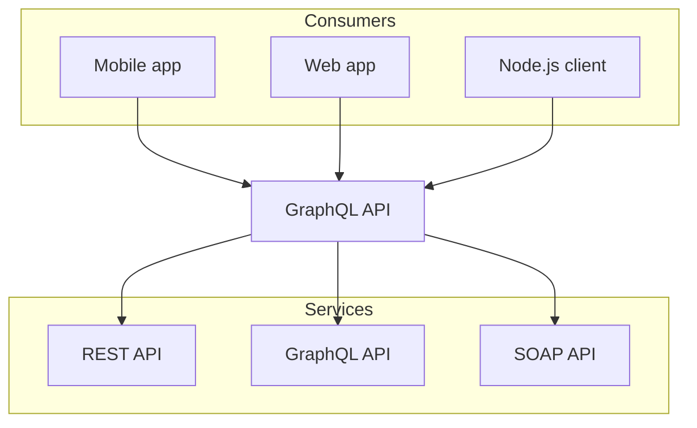

## Code Block

```typescript twoslash
const a = 1;
// @log: aaaaaaaaaaaa
const b = 1;
// @log: aaaaaaaaaaaa
```

```typescript title="Code with title"
const a = 1;
```




[inner link](./license.mdx)
