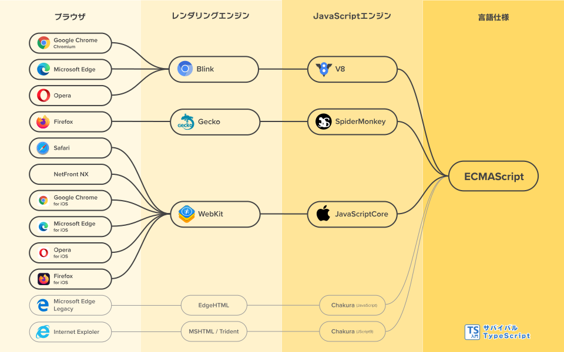

# ECMAScript

ECMAScriptはJavaScriptの仕様です。TypeScriptもECMAScriptに準拠しています。ECMAScriptとは何なのか、仕様改定のプロセス、ECMAScriptとブラウザの関係がどのようになっているかについて解説します。

## JavaScriptとECMAScriptの関係

ECMAScriptはJavaScriptの仕様を定義したものです。仕様とは決まりごとのことで、ブラウザなどがJavaScriptを読み込んだときに、どのような文法を解釈しなければならないか、処理がどのように動くべきかといったことを決めたものです。ECMAScriptという異なる名前がついていますが、JavaScriptと別の言語があるわけではありません。

歴史的には、JavaScriptを標準化するべく、ECMAScriptが策定されました。JavaScriptはNetscape社が開発した言語です。Netscape社が発表してすぐに、Microsoft社もJScriptという名前で実装しました。Netscape社は、JavaScriptを標準化するために、国際規格策定団体Ecmaインターナショナルに依頼します。Ecmaによって標準化されたJavaScriptは「ECMAScript」と呼ばれることになりました。

現在のECMAScriptは、JavaScriptの仕様という立場です。ブラウザなどのJavaScript実装が、従うべき仕様という位置づけです。この関係性から、ECMAScriptの実装のこと指してJavaScriptと呼ぶことがあります。ECMAScriptは仕様なので、ECMAScriptというプログラムがあるわけではありません。ダウンロードしたりインストールするものではないということです。

JavaScriptの仕様が「ECMAScript」と名付けられた理由は諸説あります。当時、競争関係だったNetscape社とMicrosoft社で、ECMAScriptが合意できる妥協案だった説があります。Netscape社はJavaScriptという名前で開発し、Microsoft社はJScriptという名前で開発していました。JavaScriptが商標というのも一因だと考えられています。JavaScriptは当時Sunが所有する商標でした。その後、権利はOracleに引き継がれます。

ECMAScriptはEcmaインターナショナルが策定しています。この団体では、情報通信技術のさまざまな国際規格を策定しています。各規格には番号が割り振られています。ECMAScriptの規格番号はECMA-262です。他にもJSON(ECMA-404)やC#(ECMA-334)などがあります。Ecmaインターナショナルにはさまざまな専門委員会があり、ECMAScriptを策定する委員会の名称はTC39です。

## ECMAScriptの仕様改定

ECMAScriptは毎年1回、仕様改定されます。改定されるごとにバージョンが上がります。ECMAScriptのバージョンはリリースされた西暦になってます。たとえば、2021年に改定されたECMAScriptはES2021となります。TypeScriptもECMAScriptの仕様改定に合わせて、アップデートされていきます。

ECMAScriptの改定は、募集された提案から始まります。応募のあった改定案は[TC39のGitHub](https://github.com/tc39/proposals)で一覧できます。

進捗に応じて、各提案にはステージ0からステージ4までのランクがつきます。条件を満たすとそのステージに進めます。

| ステージ      | 条件                                                                                                                               |
| ------------- | ---------------------------------------------------------------------------------------------------------------------------------- |
| 0 Strawperson | なし                                                                                                                               |
| 1 Proposal    | チャンピオン(委員会の改定推進パートナー)が決まっていること。課題と解決策を説明したリポジトリが公開されていること。デモがあるとよい |
| 2 Draft       | ECMAScriptの仕様記述言語で主要な部分の仕様が書かれていること                                                                       |
| 3 Candidate   | 完全な仕様書があること。レビュアとECMAScript編集者の署名があること                                                                 |
| 4 Finished    | 2つ以上のJSエンジンに実装が存在していること。ECMAScriptへプルリクエストが送信されており、ECMAScript編集者に承認されていること      |

ステージ2以下の提案は仕様が大きく変わる可能性が高いです。提案が取り下げられる可能性も高いです。

ステージ3になると、改定が確実視されます。TypeScriptはステージ3に達した提案に対応します。この頃にはブラウザでもステージ3の提案が実装されます。中には実装が遅れるケースもあります。

ステージ4になると、ほぼ間違いなくECMAScriptの仕様になります。ステージ4の提案は、例年6月のECMAScriptの改定に加えられます。改定までのおおよその年間スケジュールは次の流れです。

- 2月: 候補ドラフトが作成される
- 3月: ステージ4の提案が組み込まれ、最終的な仕様が承認される
- 4月〜6月: ECMA CCおよびECMA GAのレビュー期間
- 6月: ECMAの総会による承認を経て、改定仕様の確定

## ECMAScriptとブラウザの仕様

ECMAScriptが決めるクライアントサイドJavaScriptの仕様は部分的です。ECMAScriptが定める範囲は、言語の文法、構文の解釈方法、コアのAPIなど言語の中核部分です。たとえば、次のようなことを定めています。

- 関数宣言の書き方はこういう文法になる
- 変数が宣言されたとき、JavaScriptエンジンはこういう動作になる
- `String`や`Array`オブジェクトにはこういうメソッドがある

JavaScriptのうちブラウザ仕様に関する部分は、HTML Living Standardが決めています。ブラウザでJavaScriptを使うと、触れることになるのが`window`オブジェクトや`HTMLDivElement`、ローカルストレージなどのAPIです。これらは[HTML Living Standard](https://html.spec.whatwg.org/)と呼ばれる規格が定めています。この規格はEcmaインターナショナルとは異なる標準化団体WHATWGが策定しています。

JavaScriptの機能の中でも、ECMAScriptとHTML Living Standardで役割分担があるものもあります。たとえばモジュールです。ECMAScriptはモジュールの仕様を定めます。`import`や`export`の構文や、モジュール内部の仕様などは、ECMAScriptが定めます。一方、モジュールの具体的なロード方法はHTML Living Standardが定めています。たとえば、`import "指定子";`の指定子の部分にどんな文字列を書いていいか、モジュールはどの順番でロードするかなどはHTML Living Standardが定めます。

[モジュール](../reference/modules.md)

「JavaScript」と一言で言っても、複数の規格で構成されているわけです。

## ECMAScriptとブラウザの関係性

主要なブラウザの内部を分解すると、レンダリングエンジンやJavaScriptエンジンと呼ばれる部品の単位があります。

JavaScriptエンジンは、ECMAScriptを実装したモジュールです。JavaScriptエンジンには、主要なものでV8、SpiderMonkey、JavaScriptCoreがあります。

レンダリングエンジンは、JavaScriptエンジンを組み込んだブラウザの表示機能を担うモジュールです。有名なレンダリングエンジンは、Blink、Gecko、WebKitがあります。たとえば、BlinkはV8をJavaScriptエンジンに採用しています。レンダリングエンジンはJavaScriptだけでなく、HTMLやCSSを解釈し、画面描画を総合的に行います。

ブラウザは、レンダリングエンジンを組み込み、その他にブックマーク機能などの付属機能をつけてアプリケーションというかたちでユーザーに提供されます。たとえば、Google ChromeはBlinkを、SafariはWebKitを組み込んでいます。ブラウザはレンダリングエンジンを変更することもあります。Microsoft Edgeはかつて、EdgeHTMLを採用していましたが、のちにGoogle Chromeと同じBlinkに移行しました。OperaのレンダリングエンジンもPrestoでしたが、Blinkに変更した経緯があります。

同じブラウザブランドでも、iOS版のブラウザのレンダリングエンジンはWebKitです。たとえば、Google ChromeはBlinkを採用していますが、iOS版のGoogle ChromeのレンダリングエンジンはWebKitです。これは、iOSのレンダリングエンジンにWebKitだけが独占的に利用を許されているためです。

<figure>
<figcaption>ブラウザ、レンダリングエンジン、JavaScriptエンジン、ECMAScriptの関係図</figcaption>

</figure>

TypeScriptプログラマーがブラウザとエンジンの対応を理解しておくことは重要です。エンジンを知ることは、開発したプログラムが実行される環境を把握することと同義です。エンジンは仕様にできるだけ準拠しますが、エンジンによって実装が異なることがあります。エンジンによっては実装がされていない仕様がある場合もあります。また、ブラウザによっては古いエンジンを使っている場合もあります。

プログラムをテストするときも、ブラウザとエンジンの組み合わせが理解できていると、同じエンジンを採用しているブラウザはテストを省略できる場合もあります。iOSのWebKit独占の例のように、同じブランド名のブラウザでもエンジンが異なる場合があります。この場合、テストで網羅するブラウザを増やすといった意思決定が行えるようになります。

<TweetILearned>

・ECMAScript(ES)はJavaScriptの仕様
・ESはEcmaインターナショナルのTC39委員会が定める
・ESは毎年6月に改定される
・ESの改定提案は公募され、ステージ4で採用される
・ブラウザはレンダリングエンジンとJSエンジンを持つ
・JSエンジンはESを実装する

</TweetILearned>
