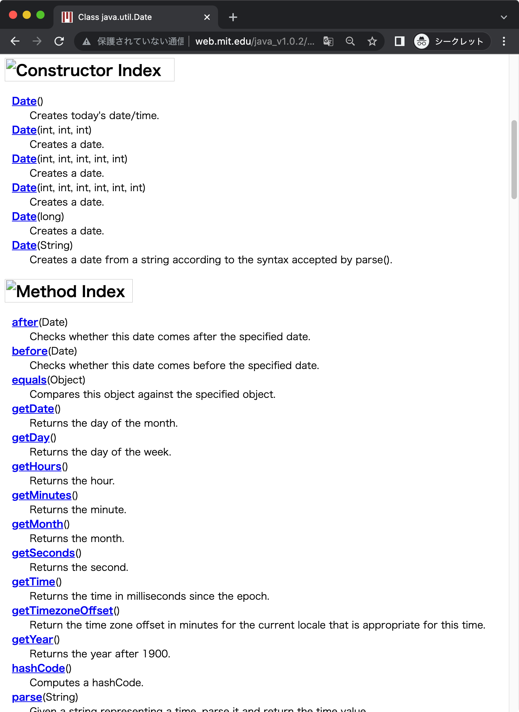
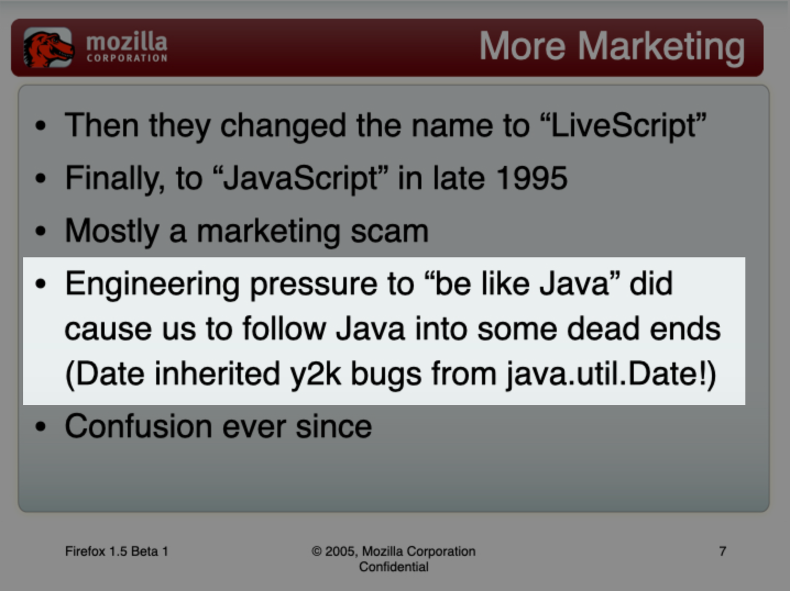

Dateは時刻のためのJavaScriptの読み込みクラスです。DateオブジェクトはUTC(協定世界時)の1970/01/01からの経過ミリ秒を表す数値を含んでいます。

## はじめに、Dateオブジェクトについて

JavaScriptの組み込み`Date`オブジェクトの使用にはいくつかの注意が必要です。次に、主な問題点を挙げます。

1. **非直感的な動作**: `Date`オブジェクトは、常識的には存在しない日付を解析しようとすると自己補正を試みます。たとえば、存在しない日付である2月30日を`Date`オブジェクトとして表現しようとすると、JavaScriptはこれを3月1日に補正します。これは読み手に混乱をもたらし、予期しない結果を生む可能性があります。
2. **フォーマットが手間**: `Date`オブジェクトを特定のフォーマットで表示するためには、しばしば独自のフォーマット関数を作成する必要があります。これは手間がかかるだけでなく、バグの原因ともなり得ます。
3. **タイムゾーンの扱い**: JavaScriptの`Date`オブジェクトは、常にローカルタイムゾーンで時間を表示します。しかし、ユーザーが世界中のさまざまな時間帯に分散している場合、これは非常に混乱を招きます。

以上のような問題を解決するために、`date-fns`や`Day.js`のようなサードパーティのライブラリの使用を推奨します。これらのライブラリは、シンプルで一貫したAPIと豊富な日付操作関数を提供し、タイムゾーンの問題を適切に処理します。また、日付を表示するための多くのフォーマットオプションも提供します。

したがって、シンプルなタスクにはJavaScriptの組み込み`Date`オブジェクトが適していますが、より複雑な日付や時間の操作が必要な場合は、適切なサードパーティのライブラリを選択することを検討してください。これにより、日付と時間に関連する操作がより確実で効率的になります。

### サードパティーの日付ライブラリ

#### [date-fns](https://date-fns.org/)

オブジェクトというよりは関数として日付の操作をします。直接Dateオブジェクトを操作する上での煩わしい点をカバーします。

#### [Day.js](https://day.js.org/)

軽量な日付操作のためのオブジェクトを提供します。後述するMoment.jsとAPIに互換性があり、Moment.jsを使っているプロジェクトでの乗り換え先に検討されることがあります。

#### [Moment.js](https://momentjs.com/)

日付操作のためのパッケージとして絶大な知名度がありますが現在は新規開発は行われておらず、積極的に新規プロジェクトで導入する必要はありません。

## Dateの操作

### 年を取得する - `Date.prototype.getFullYear()`

年を取得します。誤って`Date.prototype.getYear()`を使用しないでください。

### 年の下2-3桁を取得する - `Date.prototype.getYear()`

**非推奨です**。与えられた日付の年数を表す数値から1900を引いた値を返します。代わりに`Date.prototype.getFullYear()`を使ってください。

### 月を取得する - `Date.prototype.getMonth()`

月を取得しますが、0-11を返すため実際の月にするためには1を加算してください。

### 日を取得する - `Date.prototype.getDate()`

日を取得します。誤って`Date.prototype.getDay()`を使用しないでください。

### 曜日を取得する - `Date.prototype.getDay()`

曜日を取得します。0-6を返します。０が日曜日、1が月曜日のようになっています。

### 時を取得する - `Date.prototype.getHours()`

時を取得します。

### 分を取得する - `Date.prototype.getMinutes()`

分を取得します。

### 秒を取得する - `Date.prototype.getSeconds()`

秒を取得します。

### ミリ秒を取得する - `Date.prototype.getMilliseconds()`

ミリ秒を取得します。

### UTC 1970/01/01 00:00:00からの経過ミリ秒を取得する - `Date.prototype.getTime()`

協定世界時の1970/01/01 00:00:00からの経過ミリ秒単位の数値で返します。

### ISO8601に準じた文字列に変換する - `Date.prototype.toJSON()`

ISO8601に準じた文字列を返します。ISO8601は`YYYY-MM-DDThh:mm:ss.sssZ`の形式です。

## コラム: Dateの問題点の由来

Dateの設計はとてもプリミティブであるため、yyyy年m月d日のような一般的な日付書式への変換には少なくないコードが必要です。

```ts twoslash title="Dateの日付フォーマット処理"
const d = new Date();
const year = d.getFullYear();
const month = d.getMonth() + 1;
const day = d.getDate();
console.log(`${year}年${month}月${day}日`);
```

他にもDateにはタイムゾーンの具体的な識別（例：'America/Los_Angeles'）や、タイムゾーンの変換に便利なメソッドがありません。使い勝手の悪さから、[Moment.js](https://momentjs.com/)や[date-fns](https://date-fns.org/)といったサードパーティの日付ライブラリにお世話になった人も多いのではないでしょうか。あまりの不評もあって、[Temporal](https://tc39.es/proposal-temporal/docs/ja/index.html)というモダンな日付ビルトインAPIも検討されはじめています。

ところで、Dateはどうしてこのような微妙な実装になっているのでしょうか。これには歴史が関係します。JavaScriptを実装するのにブレンダン・アイク氏に与えられたのは、わずか10日だったそうです。この工期には日付処理の実装も含まれていました。日付処理は複雑でフルスクラッチで作ったら時間がかかるものです。工期短縮のため、実装は当時のJavaの`java.util.Date`から移植されることになりました[^1]。

[^1]: https://maggiepint.com/2017/04/09/fixing-javascript-date-getting-started/

Javaの日付処理を知っている人なら「Java由来なら、どうしてこんなひどい実装になったんだ！？」と思われるかもしれません。今のJavaの日付処理はとても立派なものです。実は、当時のJavaの`java.util.Date`は今のJavaの日付処理とは、全然異なるものだったのです。それは評判の良くないものだったそうです。

当時の[Java(1.0系)の`java.util.Date`のドキュメント](http://web.mit.edu/java_v1.0.2/www/javadoc/java.util.Date.html)。見てみると、たしかにJavaScriptのDateとインターフェースがそっくりです。移植されたというのが、ここからも垣間見えます。



あまりにもそっくり移植されてしまったため、[2000年問題]のバグまで引き継いでしまったそうです[^2]。

[2000年問題]: https://ja.wikipedia.org/wiki/2000%E5%B9%B4%E5%95%8F%E9%A1%8C



[^2]: https://www.mozilla.org/js/language/ICFP-Keynote.ppt

```js twoslash title="2000年問題のバグ"
console.log(new Date(1999, 3, 1).getYear());
// @log: 99
console.log(new Date(2000, 3, 1).getYear());
// @log: 100
```

バグと言いましたが、今となっては[仕様になっています](https://tc39.es/ecma262/#sec-date.prototype.getyear)。

Javaでは1.0の`java.util.Date`が良くなかったため、Java 1.1のリリースですぐに非推奨になり、新しい日付処理に置き換えられていきました。その結果、Javaの日付ライブラリは十分に使いやすいものになっています。Javaを真似したJavaScriptはその後どうなったかというと、20年以上Dateはそのままです。
