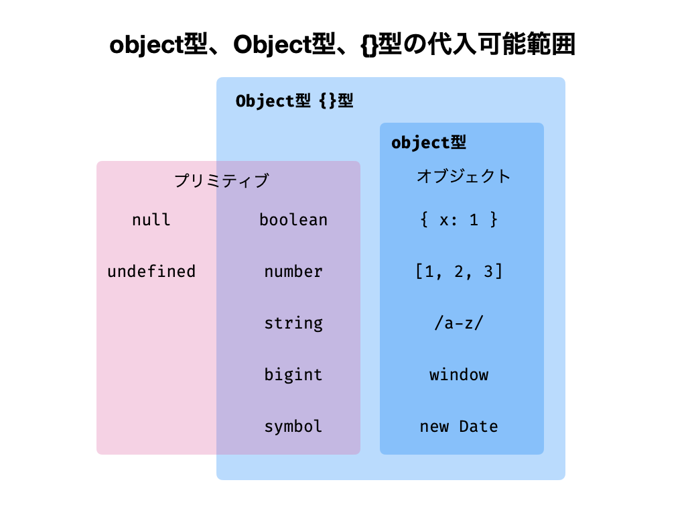

TypeScriptではオブジェクトの型注釈をするとき、プロパティの型まで指定するのが一般的です。

```ts twoslash
let obj: { a: number; b: number };
```

[オブジェクトの型注釈 (type annotation)](type-annotation-of-objects.md)

そういった一般的な型注釈とは異なり、プロパティの型を指定せず、ざっくり「オブジェクトであること」を型注釈する方法もあります。`object`型や`Object`型、`{}`型を使うものです。

```ts twoslash
let a: object;
let b: Object;
let c: {};
```

これらはどれもオブジェクト型の値ならどんなものでも代入可能になる型です。

```ts twoslash
const a: object = {}; // OK
const b: Object = {}; // OK
const c: {} = {}; // OK
```

## object型、Object型、{}型の違い

`object`型や`Object`型、`{}`型の3つは類似する部分がありますが、`object`型と他の2つは異なる点があります。

### object型

`object`型はオブジェクト型の値だけが代入できる型です。JavaScriptの値はプリミティブ型かオブジェクト型かの2つに大分されるので、`object`型はプリミティブ型が代入できない型とも言えます。

```ts twoslash
// @errors: 2322
let a: object;
a = { x: 1 }; // OK
a = [1, 2, 3]; // OK。配列はオブジェクト
a = /a-z/; // OK。正規表現はオブジェクト

// プリミティブ型はNG
a = 1;
a = true;
a = "string";
```

[プリミティブ以外はすべてオブジェクト](non-primitives-are-objects.md)

### Object型

`Object`型はインターフェースです。`valueOf`などのプロパティを持つ値なら何でも代入できます。したがって、`Object`型には`null`や`undefined`を除くあらゆるプリミティブ型も代入できます。文字列型や数値型などのプリミティブ型は自動ボックス化により、オブジェクトのようにプロパティを持てるからです。

```ts twoslash
// @errors: 2322
let a: Object;
a = {}; // OK

// ボックス化可能なプリミティブ型OK
a = 1; // OK
a = true; // OK
a = "string"; // OK

// nullとundefinedはNG
a = null;
a = undefined;
```

[ボックス化 (boxing)](../boxing.md)

`Object`型は[TypeScriptの公式ドキュメントで使うべきでないとされています](https://www.typescriptlang.org/docs/handbook/declaration-files/do-s-and-don-ts.html#number-string-boolean-symbol-and-object)。理由はプリミティブ型も代入できてしまうためです。もしオブジェクト型ならなんでも代入可にしたい場合は、代わりに`object`型を検討すべきです。

### {}型

`{}型`は、プロパティを持たないオブジェクトを表す型です。プロパティを持ちうる値なら何でも代入できます。この点は`Object`型と似ていて、`null`や`undefined`を除くあらゆる型を代入できます。

```ts twoslash
// @errors: 2322
let a: {};
a = {}; // OK

// ボックス化可能なプリミティブ型OK
a = 1; // OK
a = true; // OK
a = "string"; // OK

// nullとundefinedはNG
a = null;
a = undefined;
```

### object型、Object型、{}型の代入範囲

`object`型や`Object`型、`{}`型の代入範囲をまとめると次の図のようになります。



<TweetILearned>

TypeScriptにはよく似た型にobject、Object、{}がある。どれも「オブジェクト」を指す型。

✅object、Object、{}の違い
1️⃣object型: オブジェクトのみ代入可能
2️⃣Object型、{}型: オブジェクトとnull、undefinedを除くプリミティブ型が代入可能

</TweetILearned>
