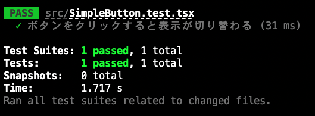
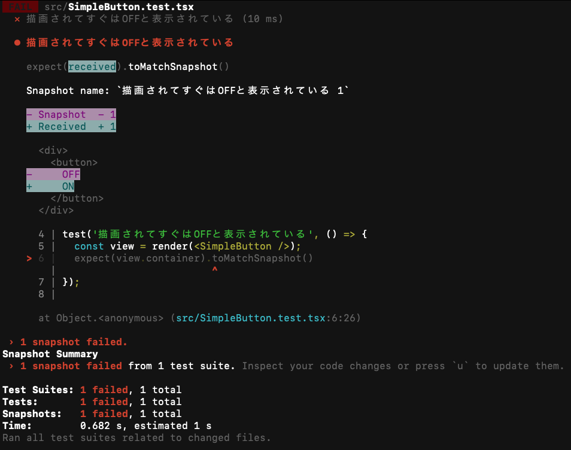

# Viết test cho React component

Trong tutorial này, bạn sẽ học cách viết test cho React component.

## Những gì có thể học trong chương này

Trong chương này, với mục tiêu viết test cho component đơn giản, cụ thể chúng ta sẽ làm những điều sau.

- Tạo test sử dụng nhóm library `testing-library` cho UI test
- Tạo snapshot test sử dụng `Jest`

Mục đích của chương này không phải là hiểu hoàn toàn test cho component. Thay vào đó, trọng tâm là trải nghiệm thực tế đó là gì. Do đó, nội dung khá tối thiểu, nhưng ngược lại, đây là nội dung đơn giản có thể thử test component trong thời gian ngắn, nên hãy thử thực hành.

:::info
Giả định là bạn có thể tạo component với React, nếu muốn biết cách sử dụng cơ bản của React, hãy tham khảo [Tạo nút Like với React](./react-like-button-tutorial.md).
:::

Test code hoàn chỉnh được tạo trong tutorial này có thể xem tại [GitHub](https://github.com/yytypescript/component-test-tutorial/blob/main/src/SimpleButton.test.tsx).

## Những thứ cần thiết cho tutorial này

Để thực hiện tutorial này, cần có một số tool. Hãy chuẩn bị trước những thứ được liệt kê ở đây.

- Node.js (Tutorial này được xác nhận hoạt động với v18.15.0)
- NPM
- Yarn v1 (Tutorial này được xác nhận hoạt động với v1.22.19)

Về cách giới thiệu Node.js, vui lòng xem [Chuẩn bị môi trường phát triển](./setup.md).

Chúng ta sẽ sử dụng Yarn làm package management tool. Hãy install trước. Nếu đã install rồi thì có thể bỏ qua bước này.

```shell
npm install -g yarn
```

## Tạo React project

Tạo React project để sử dụng cho test. Hãy chạy lệnh sau.

```shell
yarn create react-app component-test-tutorial --template typescript
```

Nếu thành công, thư mục `component-test-tutorial` sẽ được tạo trong thư mục hiện tại. Chạy lệnh sau để di chuyển vào `component-test-tutorial`.

```shell
cd component-test-tutorial
```

Cấu trúc file bên trong `component-test-tutorial` sẽ như sau.

```text
├── .gitignore
├── node_modules
├── README.md
├── package.json
├── public
│   ├── favicon.ico
│   ├── index.html
│   ├── logo192.png
│   ├── logo512.png
│   ├── manifest.json
│   └── robots.txt
├── src
│   ├── App.css
│   ├── App.test.tsx
│   ├── App.tsx
│   ├── index.css
│   ├── index.tsx
│   ├── logo.svg
│   ├── react-app-env.d.ts
│   ├── reportWebVitals.ts
│   └── setupTests.ts
├── tsconfig.json
└── yarn.lock
```

Ở đây hãy chạy lệnh sau.

```shell
yarn start
```

Browser sẽ tự động mở, nếu hiển thị như hình sau thì việc tạo project đã thành công.


## Component sẽ test

Ở đây, chúng ta sẽ tiến hành với ví dụ viết test cho button component đơn giản. Cụ thể, đây là button với text ban đầu là `OFF`, mỗi lần click button thì text chuyển đổi giữa `ON`/`OFF`.


Với component này, hãy test việc hiển thị `ON`/`OFF` chuyển đổi khi click button.

## Tạo component cần test

Để tạo test, đầu tiên hãy implement component cần test. Tạo file với tên `SimpleButton.tsx` trong thư mục `src`.

```shell
cd src
touch SimpleButton.tsx
```

Sau khi tạo file này, cấu trúc file của thư mục `src` sẽ như sau.

```text
├── App.css
├── App.test.tsx
├── App.tsx
├── SimpleButton.tsx
├── index.css
├── index.tsx
├── logo.svg
├── react-app-env.d.ts
├── reportWebVitals.ts
└── setupTests.ts
```

Nội dung của `SimpleButton.tsx` như sau.

```tsx twoslash title="SimpleButton.tsx"
// @noErrors
import { useState } from "react";

export const SimpleButton: () => JSX.Element = () => {
  const [state, setState] = useState(false);
  const handleClick = () => {
    setState((prevState) => !prevState);
  };
  return <button onClick={handleClick}>{state ? "ON" : "OFF"}</button>;
};
```

Ở đây, hãy xác nhận behavior của component `SimpleButton` này. Hãy thay đổi file `index.tsx` như sau và save.

```tsx twoslash title="index.tsx"
// @noErrors
import React from "react";
import ReactDOM from "react-dom/client";
import { SimpleButton } from "./SimpleButton";

const root = ReactDOM.createRoot(
  document.getElementById("root") as HTMLElement
);
root.render(
  <React.StrictMode>
    <SimpleButton />
  </React.StrictMode>
);
```

Sau đó hãy chạy lệnh sau.

```shell
yarn start
```

Browser sẽ tự động mở, button như sau sẽ hiển thị. Ban đầu hiển thị `OFF`, hãy xác nhận `ON` và `OFF` chuyển đổi lần lượt khi click.


:::info
Nếu button nhỏ, hãy thử tăng tỷ lệ phóng to của browser.
:::

Đến đây đã tạo xong component sẽ test lần này.

## Cách tạo và thực hiện test sử dụng `testing-library`

Từ đây chúng ta sẽ vào phần cách tạo và thực hiện test. Lần này, chúng ta sẽ test việc hiển thị `ON`/`OFF` chuyển đổi khi click button.

Có nhiều cách test React component, ở đây chúng tôi giới thiệu cách sử dụng nhóm library gọi là `testing-library` có số người dùng tương đối nhiều. `testing-library` là nhóm library để test UI component, có thể render component và thao tác với component. Với `testing-library`, có thể coi là có thể test component đầy đủ.

### Install testing-library

Hãy chạy lệnh sau để install testing-library.

```shell
yarn add \
  @testing-library/react@14 \
  @testing-library/jest-dom@5 \
  @testing-library/user-event@14
```

### Tạo test

Vậy hãy thực sự tạo test sử dụng `testing-library`. Đầu tiên, tạo file `SimpleButton.test.tsx` trong cùng thư mục `src` như trước.

```shell
touch SimpleButton.test.tsx
```

Viết template để thực thi test trong file này.

```tsx twoslash title="SimpleButton.test.tsx"
// @noErrors
test("Khi click button, hiển thị ON/OFF chuyển đổi", async () => {
  // Viết nội dung test ở đây
});
```

Thêm nội dung test vào đây. Lần này chúng ta muốn test hiển thị `ON`/`OFF` chuyển đổi khi click button, nên test code sẽ theo flow sau.

1. Render button
2. Xác nhận hiển thị `OFF`
3. Click button
4. Xác nhận hiển thị `ON`

:::info
Test component được thực hiện bằng cách kết hợp 2 điều sau sau khi render component.

1. Thực hiện thao tác với component
2. Xác nhận trạng thái của component

Ví dụ lần này cũng bắt đầu từ xác nhận trạng thái "hiển thị `OFF`" sau khi render button, thực hiện thao tác "click", sau đó lại xác nhận trạng thái "hiển thị `ON`". Khi bạn tự viết test cho component, việc ý thức thao tác và xác nhận trạng thái nào cần thực hiện sẽ giúp tạo test suôn sẻ hơn.
:::

Đầu tiên hãy thử render button. Render component chỉ cần sử dụng `render()` của `@testing-library/react` như sau. Lưu ý là `@testing-library/react` này đã được install trong project vì chúng ta tạo React application bằng `yarn create react-app`.

```tsx twoslash {1,2,5} title="SimpleButton.test.tsx"
// @noErrors
import { render } from "@testing-library/react";
import { SimpleButton } from "./SimpleButton";

test("Khi click button, hiển thị ON/OFF chuyển đổi", async () => {
  render(<SimpleButton />);
});
```

Button đã được render, tiếp theo xác nhận hiển thị `OFF`. Cụ thể, lấy DOM của button (DOM ở đây hãy hiểu đại khái là object biểu diễn button), thực hiện assertion xem text của nó có bằng string `OFF` không. Lần này, để lấy DOM của button, chúng ta sử dụng `getByRole()`, một trong các query được `@testing-library/react` cung cấp. Đây là query lấy component có Role được chỉ định trong argument theo [WAI-ARIA](https://developer.mozilla.org/ja/docs/Learn/Accessibility/WAI-ARIA_basics) (specification web được định nghĩa chủ yếu để cải thiện accessibility). Chi tiết vui lòng tham khảo [tài liệu chính thức](https://testing-library.com/docs/queries/byrole). Cụ thể có thể viết như sau.

```tsx twoslash {1-2,7} title="SimpleButton.test.tsx"
// @noErrors
import { render, screen } from "@testing-library/react";
//               ^^^^^^thêm
import { SimpleButton } from "./SimpleButton";

test("Khi click button, hiển thị ON/OFF chuyển đổi", async () => {
  render(<SimpleButton />);
  const simpleButton = screen.getByRole("button");
});
```

Và assertion text của button sử dụng `toHaveTextContent()` được `@testing-library/jest-dom` cung cấp. Truyền component vào `expect()` và gọi `toHaveTextContent()` như vậy có thể thực hiện assertion text mà component đó có. Cụ thể như sau.

```tsx twoslash {7} title="SimpleButton.test.tsx"
// @noErrors
import { render, screen } from "@testing-library/react";
import { SimpleButton } from "./SimpleButton";

test("Khi click button, hiển thị ON/OFF chuyển đổi", async () => {
  render(<SimpleButton />);
  const simpleButton = screen.getByRole("button");
  expect(simpleButton).toHaveTextContent("OFF");
});
```

Ở đây tạm thời chạy lệnh `yarn test` để xác nhận test pass.

```shell
yarn test
```

Kết quả sẽ như sau.



Tiếp theo, click button. Thao tác component có thể thực hiện bằng `@testing-library/user-event` có trong `testing-library`. `@testing-library/user-event` là library thực thi các user event khác nhau bao gồm thao tác component trong test. Cụ thể, có thể thực hiện click button bằng cách truyền `simpleButton` tìm bằng query làm argument cho `click()`.

```tsx twoslash {2,6,10} title="SimpleButton.test.tsx"
// @noErrors
import { render, screen } from "@testing-library/react";
import userEvent from "@testing-library/user-event";
import { SimpleButton } from "./SimpleButton";

test("Khi click button, hiển thị ON/OFF chuyển đổi", async () => {
  const user = userEvent.setup();
  render(<SimpleButton />);
  const simpleButton = screen.getByRole("button");
  expect(simpleButton).toHaveTextContent("OFF");
  await user.click(simpleButton);
});
```

Tiếp tục, thực hiện assertion sau khi button được click. Tương tự sử dụng `toHaveTextContent()`, nhưng lần này xác nhận text của button là `ON`.

```tsx twoslash {11} title="SimpleButton.test.tsx"
// @noErrors
import { render, screen } from "@testing-library/react";
import userEvent from "@testing-library/user-event";
import { SimpleButton } from "./SimpleButton";

test("Khi click button, hiển thị ON/OFF chuyển đổi", async () => {
  const user = userEvent.setup();
  render(<SimpleButton />);
  const simpleButton = screen.getByRole("button");
  expect(simpleButton).toHaveTextContent("OFF");
  await user.click(simpleButton);
  expect(simpleButton).toHaveTextContent("ON");
});
```

Với trạng thái này, chạy lệnh `yarn test` để xác nhận test pass. Kết quả sẽ như sau.


Đây là flow tạo test cho component sử dụng `testing-library`. Từ `testing-library`, ngoài những gì giới thiệu ở đây, còn cung cấp nhiều chức năng query, assertion và user event khác. Dù là tiếng Anh, nhưng có giải thích chi tiết bằng tài liệu chính thức về query tại [đây](https://testing-library.com/docs/queries/about), assertion tại [đây](https://github.com/testing-library/jest-dom#custom-matchers), user event tại [đây](https://testing-library.com/docs/user-event/intro). Khi tự tạo test, hãy xác nhận cả những điều đó.

## Cách tạo và thực hiện snapshot test sử dụng `Jest`

Từ đây chúng tôi giải thích về phương pháp test gọi là "snapshot test".

Test trước đó là xác nhận một phần (ví dụ: text) của trạng thái component, nhưng "snapshot test" là test để xác nhận toàn bộ trạng thái component. Chính xác hơn, lưu DOM của component nguyên vẹn và xác nhận DOM đã lưu đó có khớp với DOM được tạo khi render component lúc thực thi test không (DOM là gì nếu không hiểu rõ, ở đây tạm hiểu là "object biểu diễn component").

"Snapshot test" có thể viết dễ dàng. Hơn nữa có thể xác nhận toàn bộ bao gồm style, nên có thể tận dụng như regression test đơn giản. Mặt khác, chính vì vậy đây là test không hoạt động cho đến khi tạo xong component, nên không phù hợp với phát triển test-first.

:::caution
Về nguyên tắc, đối tượng của snapshot test không giới hạn ở component và DOM. Có thể thực hiện snapshot test cho nhiều đối tượng. Chi tiết vui lòng tham khảo [tài liệu chính thức](https://jestjs.io/ja/docs/snapshot-testing#%E3%82%B9%E3%83%8A%E3%83%83%E3%83%97%E3%82%B7%E3%83%A7%E3%83%83%E3%83%88%E3%83%86%E3%82%B9%E3%83%88%E3%81%AFreact%E3%82%B3%E3%83%B3%E3%83%9D%E3%83%BC%E3%83%8D%E3%83%B3%E3%83%88%E3%81%A7%E3%81%AE%E3%81%BF%E5%88%A9%E7%94%A8%E3%81%A7%E3%81%8D%E3%81%BE%E3%81%99%E3%81%8B) của Jest.
:::

Vậy hãy thực sự thực hiện snapshot test. Tạo file `SimpleButton.test.tsx` trong cùng thư mục `src` như trước.

```shell
touch SimpleButton.test.tsx
```

:::info
Nếu bạn tiếp tục thực hiện tutorial này từ "Cách tạo và thực hiện test sử dụng `testing-library`", cũng có thể viết thêm test case tạo từ đây vào `SimpleButton.test.tsx`.
:::

Snapshot test bao gồm 2 bước sau.

1. Đưa component vào trạng thái muốn xác nhận snapshot
2. So khớp với snapshot

Ở đây chúng ta xem xét thực hiện snapshot test về trạng thái button được render và chưa có thao tác gì, tức là trạng thái button hiển thị OFF. Vì muốn xác nhận trạng thái vừa render, chỉ cần thực hiện so khớp snapshot ngay sau khi render.

Dựa trên suy nghĩ này, hãy viết code thực tế. Render component sử dụng hàm `render` của `@testing-library/react`, so khớp snapshot sử dụng hàm `toMatchSnapshot()` của Jest và có thể viết như sau.

```tsx twoslash title="SimpleButton.test.tsx"
// @noErrors
import { render } from "@testing-library/react";
import { SimpleButton } from "./SimpleButton";

test("Vừa render hiển thị OFF", () => {
  const view = render(<SimpleButton />);
  expect(view.container).toMatchSnapshot();
});
```

:::info
Jest đơn lẻ không thể render React component. Vì vậy, cần sử dụng library để render component. Có nhiều library, nhưng ở đây chúng tôi sử dụng `@testing-library/react` đã giới thiệu trong chương trước "Cách tạo và thực hiện test sử dụng `testing-library`".
:::

Sau khi tạo test file, chạy lệnh `yarn test`.

```shell
yarn test
```

Sẽ hiển thị như sau, có thể thấy test được thực thi và thành công (`PASS`).


Bây giờ, lúc này trong thư mục `src` sẽ có thư mục `__snapshots__` được tự động thêm vào. Đây là thư mục Jest lưu file cho snapshot test. Snapshot test của Jest lần chạy đầu tiên tạo file cho snapshot test, từ lần thứ 2 thực hiện so khớp. Vì bây giờ là lần chạy đầu tiên, file và thư mục chứa nó được tự động tạo.

Ở đây để biết thêm một chút về snapshot test, hãy nhìn vào nội dung file cho snapshot test được tạo.

`SimpleButton.test.tsx.snap` được tạo trong thư mục `__snapshots__` như sau.

```js twoslash title='SimpleButton.test.tsx.snap'
// @noErrors
// Jest Snapshot v1, https://goo.gl/fbAQLP
exports[`Vừa render hiển thị OFF 1`] = `
<div>
  <button>
    OFF
  </button>
</div>
`;
```

Như vậy, file cho snapshot test bao gồm tên test case và snapshot sử dụng trong test case đó.

Bây giờ, snapshot được tạo lần này bao gồm tag `button` có text `OFF` và element `div` là parent element của nó. Điều này khớp chính xác với DOM của component `SimpleButton` vừa tạo (element `div` là element được tự động tạo khi khởi động React). Snapshot test này mỗi lần thực thi sẽ render component `SimpleButton` và xác nhận xem có sự khác biệt với snapshot vừa tạo không.
Ví dụ, nếu do sai sót nào đó mà component `SimpleButton` hiển thị `ON` khi render, sẽ bị phát hiện bởi snapshot test này.

Ở đây, hãy xác nhận tình huống fail. Thêm thay đổi để component `SimpleButton` hiển thị `ON` khi render.

```tsx twoslash {4,5} title="SimpleButton.tsx"
import { useState } from "react";

export const SimpleButton: () => JSX.Element = () => {
  const [state, setState] = useState(true);
  // Thay đổi từ false sang true               ^^^^
  const handleClick = () => {
    setState((prevState) => !prevState);
  };
  return <button onClick={handleClick}>{state ? "ON" : "OFF"}</button>;
};
```

Với trạng thái này, chạy lệnh `yarn start`, có thể thấy giá trị khởi tạo của text button được render là `ON`.

Bây giờ, chạy lệnh `yarn test`.

```shell
yarn test
```

Snapshot test trước đó được thực thi, nhưng lần này test không pass và diff giữa component được render và snapshot hiển thị.



Lần này chúng ta đã thay đổi giá trị khởi tạo của text trong button, nhưng hầu hết các thay đổi đối với DOM như thay đổi từ tag `button` sang tag `div` hay thêm class vào tag `button` đều có thể phát hiện bằng snapshot test.

Cách thực hiện snapshot test chi tiết và best practice, nếu muốn biết thêm thông tin, vui lòng tham khảo [tài liệu chính thức](https://jestjs.io/ja/docs/snapshot-testing) của Jest.

Đến đây tutorial snapshot test sử dụng Jest đã hoàn thành. Ngoài ra, tutorial test React component cũng đã hoàn thành.
