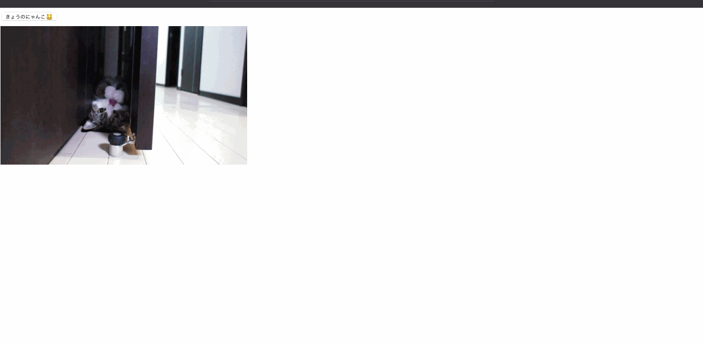

# Next.jsで猫画像ジェネレーターを作ろう

## Next.jsの概要

[Next.js](https://nextjs.org/)はVercel社が開発しているOSSのReactをベースにしたフレームワークです。
Next.js登場前はReactで開発をする際にwebpackなどのビルドツールの設定ファイルを記述するには一定の知識が必要でした。チャンク分割やCSS Modulesの読み込みをやろうとすると、非常に設定が複雑化してメンテナンスが非常に大変になっていました。

Next.jsはルーティング時のプリフェッチや画像の最適化などのパフォーマンス最適化をフレームワーク内で内包しており、ゼロコンフィグで簡単にパフォーマンスの高いアプリケーションを構築することができます。ページ単位のサーバーサイドレンダリング（SSR）や静的サイト生成(SSG)の機能も提供しており、用途に合わせて柔軟にアーキテクチャを選択できるのも特徴です。

また、[Vercel](https://vercel.com/)というプラットフォームも提供しており、Next.jsで構築したアプリケーションを簡単にデプロイ/配信することができます。

## これから作るもの

このチュートリアルでは、猫画像をランダムに表示する猫画像ジェネレーターを実装します。🐱

最終的な成果物は[こちら](https://random-cat.typescriptbook.jp/)で確認できます。
チュートリアルを開始する前に事前に触ってみることで、各ステップでどんな実装をしているかのイメージが掴みやすくなります。

また、ソースコードは[yytypescript/random-cat](https://github.com/yytypescript/random-cat)で確認することができます。

## Next.jsのセットアップ

最初に `create-next-app` でプロジェクトを作成します。
TypeScriptをベースにしたプロジェクトを作成するために `--example with-typescript` を指定します。
`random-cat` は作成するリポジトリの名前なので好きな名前で作成してください。

```sh
yarn create next-app --example with-typescript random-cat
```

プロジェクトが作成できたら、早速アプリケーションを起動してみます。
作成されたリポジトリに移動して`yarn dev`を実行します。

アプリケーションの起動に成功したら、ターミナルに表示されているURLにブラウザでアクセスしてください。

```sh
cd random-cat
yarn dev
```

## リポジトリの不要なファイルを削除

チュートリアルを進める前にファイルが沢山ある状態では作業が進めにくいので、ボイラーテンプレートで作成されたファイルを削除して、プロジェクトをシンプルな状態にします。

ディレクトリ構造を変更するので、先ほど起動したdevサーバーは一度停止してください。

最初にソースファイルのディレクトリをすべて削除して、src/pages/index.tsxを作成します。

```sh
rm -rf pages utils interfaces components
mkdir -p src/pages && touch src/pages/index.tsx
```

Next.jsでは`pages`ディレクトリが特別な意味を持っており、`pages`ディレクトリ配下のディレクトリ構造がページのルーティングに1対1で対応をします。たとえば、src/pages/users.tsxとファイルを作成した場合は、`/users` へアクセスした時にそのファイルのコンポーネントが描画されます。

src/pages/index.tsxの場合は、`/` へアクセスした時に描画されます。

## 最初のページを実装

index.tsxで「Hello,Next.js👋」と表示するようにコンポーネントを実装してみましょう。

```tsx twoslash title="pages/index.tsx"
const IndexPage = () => {
  return <h1>Hello, Next.js 👋</h1>;
};

export default IndexPage;
```

コンポーネントの実装が完了したら、改めてdevサーバーを起動してブラウで確認してみてください。


## 猫の画像を表示する

最初はAPIでデータを取得せずに静的なURLを指定して画像を表示します。

先ほど「Hello, Next.js 👋」と表示していた箇所を次のように書き換えてみてください。

```tsx twoslash {2} title="pages/index.tsx"
const IndexPage = () => {
  return ;
};

export default IndexPage;
```

猫画像を表示することができました。


## 猫の画像URLを状態で管理する

猫の画像を切り替えれるようにするために、src属性に直接指定していた画像URLを`catImageUrl`の状態変数で管理するように変更します。

```tsx twoslash {1,4,6} title="pages/index.tsx"
import { useState } from "react";

const IndexPage = () => {
  const [catImageUrl, setCatImageUrl] = useState(
    "https://cdn2.thecatapi.com/images/bpc.jpg"
  );

  return ;
};

export default IndexPage;
```

## ボタンクリックでランダムに画像を切り替える

配列で保持した猫画像のURLをランダムに返す`randomCatImage`関数を実装します。
ボタンを新しく追加して、ボタンがクリックされた時に`setCatImageUrl(randomCatImage())`でランダムな画像URLで`catImageUrl`の状態を更新して猫画像を変更するようにします。

```tsx twoslash {1-12,17-28} title="pages/index.tsx"
import { useState } from "react";

const catImages: string[] = [
  "https://cdn2.thecatapi.com/images/bpc.jpg",
  "https://cdn2.thecatapi.com/images/eac.jpg",
  "https://cdn2.thecatapi.com/images/6qi.jpg",
];

const randomCatImage = (): string => {
  const index = Math.floor(Math.random() * catImages.length);
  return catImages[index];
};

const IndexPage = () => {
  const [catImageUrl, setCatImageUrl] = useState(
    "https://cdn2.thecatapi.com/images/bpc.jpg"
  );

  const handleClick = () => {
    setCatImageUrl(randomCatImage());
  };

  return (
    <div>
      <button onClick={handleClick}>きょうのにゃんこ🐱</button>
      <div style={{ marginTop: 8 }}>
        
      </div>
    </div>
  );
};

export default IndexPage;
```

ブラウザでボタンを何回かクリックすることで、猫の画像を更新できます。


## The Cat API について

APIリクエストで猫の画像を取得する前に利用するAPIについて簡単に紹介します。

このチュートリアルでは猫の画像をランダムに表示するにあたり[The Cat API](https://thecatapi.com/)を利用します。
このAPIは特定の条件で猫の画像を取得したり、品種ごとの猫の情報を取得することができます。
今回のチュートリアルでは[APIドキュメント](https://docs.thecatapi.com/)のQuickstartに記載されている`/v1/images/search`へリクエストを投げてランダムな猫の画像を取得します。

試しにブラウザで[https://api.thecatapi.com/v1/images/search](https://api.thecatapi.com/v1/images/search)へアクセスしてみてください。

ランダムな結果が返ってくるので値は少し違うと思いますが、次のような構造のデータがレスポンスとして取得できます。レスポンスのデータ構造が配列になっている点に注意してください。

レスポンスで得られる`url`が猫の画像へアクセスするためのURLです。今回はこの値を取得して猫の画像をランダムに表示します。

```json
[
  {
    "breeds": [],
    "categories": [
      {
        "id": 2,
        "name": "space"
      }
    ],
    "id": "5dc",
    "url": "https://cdn2.thecatapi.com/images/5dc.jpg",
    "width": 760,
    "height": 500
  }
]
```

## APIリクエストで猫の画像を取得

最初にAPIリクエストで猫の画像を取得する`fetchCatImage`を実装してコンソールで確認してみます。

`fetch`はHTTPリクエストでリソースを取得するブラウザ標準のAPIです。戻り値として[Response](https://developer.mozilla.org/ja/docs/Web/API/Response)オブジェクトを返します。Responseオブジェクトの`json()`メソッドを実行することで、レスポンスのBodyテキストをJSONオブジェクトに変換するPromiseを取得できます。

```tsx twoslash {14-22} title="pages/index.tsx"
import { useEffect, useState } from "react";

const catImages: string[] = [
  "https://cdn2.thecatapi.com/images/bpc.jpg",
  "https://cdn2.thecatapi.com/images/eac.jpg",
  "https://cdn2.thecatapi.com/images/6qi.jpg",
];

const randomCatImage = (): string => {
  const index = Math.floor(Math.random() * catImages.length);
  return catImages[index];
};

const fetchCatImage = async () => {
  const res = await fetch("https://api.thecatapi.com/v1/images/search");
  const result = await res.json();
  return result[0];
};

fetchCatImage().then((image) => {
  console.log(`猫の画像: ${image.url}`);
});

const IndexPage = () => {
  const [catImage, setCatImage] = useState<string | undefined>(undefined);

  useEffect(() => {
    setCatImage(randomCatImage());
  }, []);

  const handleClick = () => {
    setCatImage(randomCatImage());
  };

  return (
    <div>
      <button onClick={handleClick}>きょうのにゃんこ🐱</button>
      <div style={{ marginTop: 8 }}>
        
      </div>
    </div>
  );
};

export default IndexPage;
```

ページを読み込んで、ChromeのDevToolsを開きコンソールタブで次のようなテキストが表示されていたら成功です。
`猫の画像: https://cdn2.thecatapi.com/images/bhg.jpg`

リンクをクリックすることで、猫の画像をブラウザで確認することもできます。

## APIのレスポンスに型付け

今の状態だと `fetchCatImage()` の戻り値が `any` のままなので、呼び出し側で存在しないプロパティを参照しても気づけずにバグが発生する危険性があります。

```ts twoslash title="pages/index.tsx"
const fetchCatImage = async () => {
  const res = await fetch("https://api.thecatapi.com/v1/images/search");
  const result = await res.json();
  return result[0];
};

fetchCatImage().then((image) => {
  // 戻り値がany型なので型エラーにならない
  console.log(image.alt);
});
```

APIレスポンスの取り扱いはフロントエンドでバグが混在しやすい箇所なので、型を指定することで安全にAPIレスポンスを扱えるようにしていきます。

レスポンスに含まれる猫画像の型を`SearchCatImage`として定義し、レスポンスのデータ構造を`SearchCatImageResponse`として定義します。

```ts twoslash title="pages/index.tsx"
interface CatCategory {
  id: number;
  name: string;
}

interface SearchCatImage {
  breeds: string[];
  categories: CatCategory[];
  id: string;
  url: string;
  width: number;
  height: number;
}

type SearchCatImageResponse = SearchCatImage[];
```

`fetchCatImage`関数の戻り値を`Promise<SearchCatImageResponse>`として型を指定します。
`res.json()`は型定義にて`Promise<any>`を返すようになっているので、型アサーション(as)を使い`as SearchCatImageResponse`とAPIレスポンスの型を指定しています。

これで、APIレスポンスに存在しないプロパティを指定している箇所で型エラーが発生するようになります。

```ts twoslash {1-15,17,19,24} title="pages/index.tsx"
// @errors: 2339
interface CatCategory {
  id: number;
  name: string;
}

interface SearchCatImage {
  breeds: string[];
  categories: CatCategory[];
  id: string;
  url: string;
  width: number;
  height: number;
}

type SearchCatImageResponse = SearchCatImage[];

const fetchCatImage = async (): Promise<SearchCatImage> => {
  const res = await fetch("https://api.thecatapi.com/v1/images/search");
  const result = (await res.json()) as SearchCatImageResponse;
  return result[0];
};

fetchCatImage().then((image) => {
  console.log(image.alt);
});
```

型アサーションはコンパイラーの型推論を上書きするため、誤ってバグを生む危険性があります。利用は最小限にして必要な場合に限り使うようにしましょう。

[型アサーション「as」(type assertion)](../reference/values-types-variables/type-assertion-as.md)

:::tip ワンポイント解説: HTTPリクエストとジェネリクス

`axios`などのHTTPクライアントライブラリではレスポンスの型をジェネリクスで指定できるようになっています。ジェネリクスで型指定ができる場合は積極的にジェネリクスを使うようにしましょう。

```ts
axios.get<SearchCatImageResponse>("https://api.thecatapi.com/v1/images/search");
```

:::

## ボタンをクリックした時にAPIで猫画像を更新

APIリクエストでランダムな猫画像の取得ができるようになったので、ボタンをクリックした時にAPIリクエストで猫画像を取得して画面を更新します。

```tsx twoslash {1-23,30-33} title="pages/index.tsx"
import { useState } from "react";

interface CatCategory {
  id: number;
  name: string;
}

interface SearchCatImage {
  breeds: string[];
  categories: CatCategory[];
  id: string;
  url: string;
  width: number;
  height: number;
}

type SearchCatImageResponse = SearchCatImage[];

const fetchCatImage = async (): Promise<SearchCatImage> => {
  const res = await fetch("https://api.thecatapi.com/v1/images/search");
  const result = (await res.json()) as SearchCatImageResponse;
  return result[0];
};

const IndexPage = () => {
  const [catImageUrl, setCatImageUrl] = useState(
    "https://cdn2.thecatapi.com/images/bpc.jpg"
  );

  const handleClick = async () => {
    const image = await fetchCatImage();
    setCatImageUrl(image.url);
  };

  return (
    <div>
      <button onClick={handleClick}>きょうのにゃんこ🐱</button>
      <div style={{ marginTop: 8 }}>
        
      </div>
    </div>
  );
};

export default IndexPage;
```

APIリクエストを経由して猫の画像をランダムに表示できるようになりました。😺


## Next.jsのデータフェッチAPI

実装に入る前にNext.jsのデータフェッチAPIについて簡単に紹介します。

Next.jsではページコンポーネントでデータをフェッチする方法として、`getInitialProps`, `getServerSideProps`,`getStaticProps`の3つがあります。

### getInitialProps

SSR（サーバーサイドレンダリング）時にサーバー側でデータ取得の処理が実行され、クライアントサイドでルーティングが発生した場合はクライアント側でデータの取得が実行されます。このAPIはサーバーとクライアントの両方で実行されるため、ユニバーサルな実装を意識する必要もあり実装難易度が上昇します。
公式ドキュメントでもこのAPIよりも次で紹介する2つのデータフェッチ手法を使うことが推奨されています。

### getServerSideProps

SSRでは`getInitialProps`と同様にサーバー側でデータの取得が実行されます。大きな違いはクライアントサイドでルーティングが発生した場合もデータの取得がサーバー側で実行される点です。サーバー側のみで実行されることが保証されるため、`getServerSideProps`内でのみ利用しているモジュールはクライアントのコードにバンドルされず配信するファイルサイズを削減することができます。また、ユニバーサルな実装を意識する必要も無いので考慮すべき点が減り、データベースから直接データを取得するような処理を記述することも可能です。

### getStaticProps

ビルド実行時にのみデータ取得が実行されます。これは他の2つと異なりページを描画する時にはデータ取得が実行されないことに注意が必要です。ユーザーログインが不要なLPやブログなどの静的なページを構築する時に利用します。

## getServerSidePropsで初期画像もランダムに表示

これまでページを描画する時は固定の猫画像を表示していました。ページを描画するタイミングでもランダムな猫画像を表示するようにします。

最初に`IndexPage`コンポーネントで猫画像のURLを`initialCatImageUrl`プロパティとしてpropsで受け取るようにします。コンポーネントのpropsの型を`IndexPageProps`として定義して、`IndexPage: NextPage<IndexPageProps>`で受け取るpropsの型を指定します。

この時点では、`initialCatImageUrl`はundefinedとなるので、一時的に猫画像が表示されない状態になっています。

```tsx twoslash {2,26-28,30-31} title="pages/index.tsx"
import { useState } from "react";
import type { NextPage } from "next";

interface CatCategory {
  id: number;
  name: string;
}

interface SearchCatImage {
  breeds: string[];
  categories: CatCategory[];
  id: string;
  url: string;
  width: number;
  height: number;
}

type SearchCatImageResponse = SearchCatImage[];

const fetchCatImage = async () => {
  const res = await fetch("https://api.thecatapi.com/v1/images/search");
  const result = (await res.json()) as SearchCatImageResponse;
  return result[0];
};

interface IndexPageProps {
  initialCatImageUrl: string;
}

const IndexPage: NextPage<IndexPageProps> = ({ initialCatImageUrl }) => {
  const [catImageUrl, setCatImageUrl] = useState(initialCatImageUrl);

  const handleClick = async () => {
    const image = await fetchCatImage();
    setCatImageUrl(image.url);
  };

  return (
    <div>
      <button onClick={handleClick}>きょうのにゃんこ🐱</button>
      <div style={{ marginTop: 8 }}>
        
      </div>
    </div>
  );
};

export default IndexPage;
```

続いて`getServerSideProps`で猫画像を取得して、`IndexPage`にpropsとして渡します。

```tsx twoslash {2,52-61} title="pages/index.tsx"
import { useState } from "react";
import type { NextPage, GetServerSideProps } from "next";

interface IndexPageProps {
  initialCatImageUrl: string;
}

interface CatCategory {
  id: number;
  name: string;
}

interface SearchCatImage {
  breeds: string[];
  categories: CatCategory[];
  id: string;
  url: string;
  width: number;
  height: number;
}

type SearchCatImageResponse = SearchCatImage[];

const fetchCatImage = async () => {
  const res = await fetch("https://api.thecatapi.com/v1/images/search");
  const result = (await res.json()) as SearchCatImageResponse;
  return result[0];
};

interface IndexPageProps {
  initialCatImageUrl: string;
}

const IndexPage: NextPage<IndexPageProps> = ({ initialCatImageUrl }) => {
  const [catImageUrl, setCatImageUrl] = useState(initialCatImageUrl);

  const handleClick = async () => {
    const image = await fetchCatImage();
    setCatImageUrl(image.url);
  };

  return (
    <div>
      <button onClick={handleClick}>きょうのにゃんこ🐱</button>
      <div style={{ marginTop: 8 }}>
        
      </div>
    </div>
  );
};

export const getServerSideProps: GetServerSideProps<
  IndexPageProps
> = async () => {
  const catImage = await fetchCatImage();
  return {
    props: {
      initialCatImageUrl: catImage.url,
    },
  };
};

export default IndexPage;
```

これで、ページを更新するタイミングでもランダムに猫画像が表示されるようになりました。🎉



## プロダクションビルドと実行

Next.jsでは`next build`を実行することで最適化されたプロダクション用のコードを生成でき、`next start`で生成されたプロダクションコードを実行できます。
このチュートリアルではボイラテンプレートを利用しているので、package.jsonにbuildコマンドとstartコマンドがすでに用意されています。

`yarn build`と`yarn start`を実行して本番用のアプリケーションを実行してみましょう。

```sh
yarn build && yarn start
```

アプリケーション起動後に[http://localhost:3000](http://localhost:3000)へブラウザでアクセスをすることで、本番用のアプリケーションの実行を確認できます。

以上でNext.jsで作る猫画像ジェネレーターの完成です。😸
