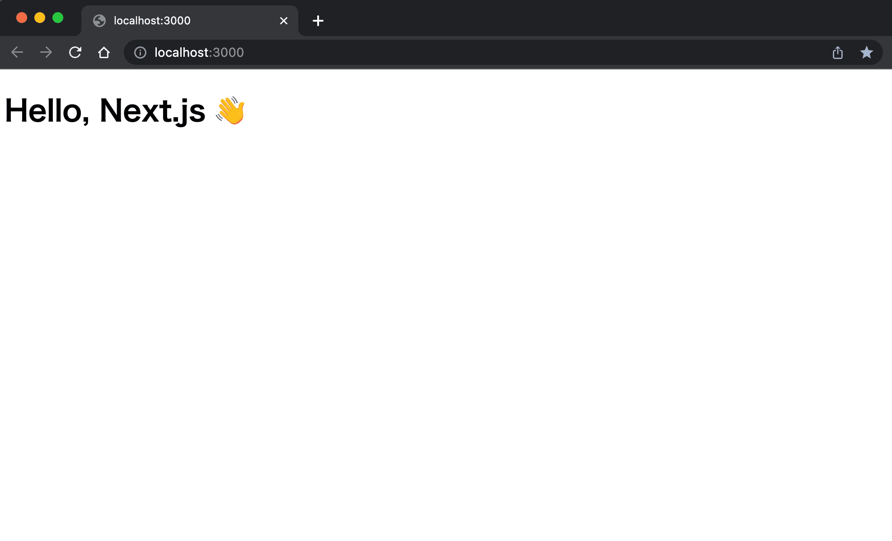
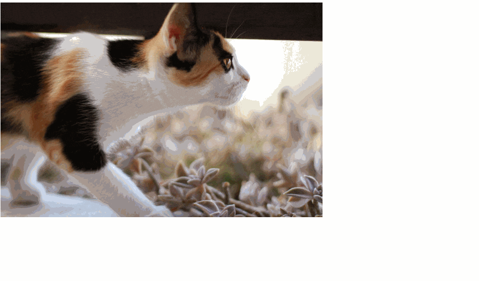
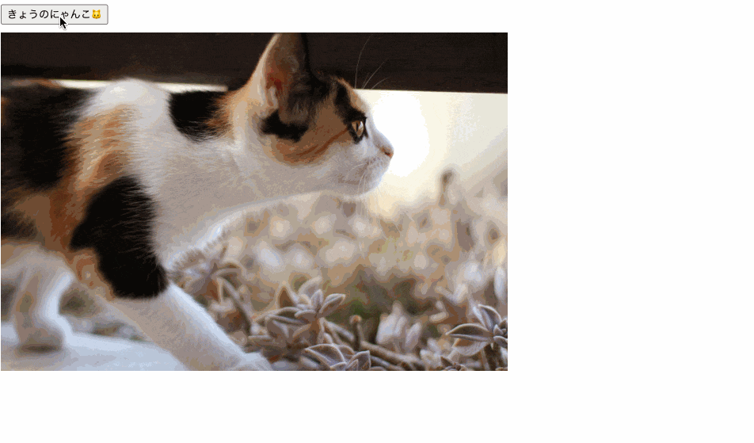
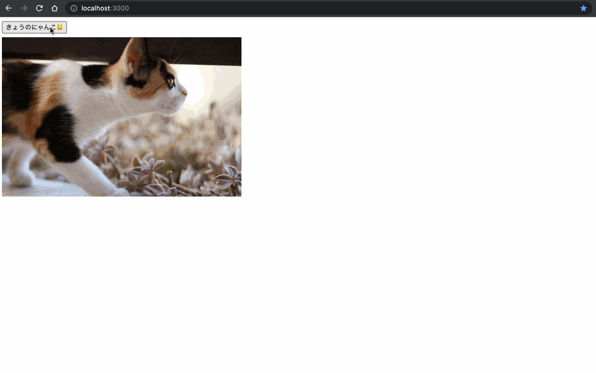

# 🚧Next.jsで○○を作ろう

:::caution 執筆中

Next.js+TypeScriptで簡単なウェブアプリケーションを作るチュートリアルを書く。

作るサンプルアプリケーションのアイディア

読者が学べるとよいこと

- Next.jsの概要
- Next.jsのインストール&セットアップ
- SSRを使ったAPI呼び出し
  => ボタンを表示してみる
  => 猫の画像の表示してみる
  => APIで猫の画像を取得して動的に表示してみる
  => SSRのタイミングで猫の画像を表示する => いきなりgetServerSidePropsは読者が混乱するので、最後にやる
  => 実装の途中で段階的に型づけをする
- プロダクションコードの生成
- Vercelへのデプロイ

- おまけ: デザインの調整

:::

## Next.jsの概要

[Next.js](https://nextjs.org/)はVercel社が開発しているOSSのReactをベースにしたフレームワークです。
Next.js登場前はReactで開発を進める上でwebpack等のビルドツールの設定ファイルを記述するには一定の知識が必要で、チャンク分割やCSS Modulesの読み込みなど多くのことをやろうとすると、非常に設定が複雑化してメンテナンスが非常に大変になっていました。

Next.jsはルーティング時のプリフェッチや画像の最適化などのパフォーマンス最適化をフレームワーク内で内包しており、ゼロコンフィグで簡単にパフォーマンスの高いアプリケーションを構築することができます。ページ単位のサーバーサイドレンダリング（SSR）や静的サイト生成(SSG)の機能も提供しているので、用途に合わせて柔軟にアーキテクチャを選択できるのも特徴です。

また、Vercelというプラットフォームを提供しており、Next.jsで構築したアプリケーションを非常に簡単にデプロイ/配信することができます。

## これから作るもの

このチュートリアルでは、猫🐱の画像をランダムに表示するWebアプリケーションを実装します。

最終的な成果物は[こちら](ホスティングしたURL)で試すことができます。
チュートリアルを開始する前に事前に触ってみることで、各ステップでどんな実装をしているかのイメージが掴みやすくなります。

また、最終的な成果物のソースコードは[yytypescript/random-cat](https://github.com/yytypescript/random-cat)で確認することができます。

## Next.jsのセットアップ

最初に `create-next-app` でプロジェクトを作成します。
TypeScriptをベースにしたプロジェクトを作成するために `--example with-typescript` を指定します。
`random-cat` は作成するリポジトリの名前なので好きな名前で作成してください。

```shell
yarn create next-app --example with-typescript random-cat
```

プロジェクトが作成できたら、早速アプリケーションを起動してみます。
作成されたリポジトリに移動して`yarn dev`を実行します。

アプリケーションの起動に成功したら、ターミナルに表示されているURLにブラウザでアクセスしてください。

```sh
cd random-cat
yarn dev
```

## リポジトリの不要なファイルを削除

チュートリアルを進める前にファイルが沢山ある状態では作業が進めにくいので、ボイラーテンプレートで作成されたファイルを削除して、プロジェクトをシンプルな状態にします。

ディレクトリ構造を変更するので、先ほど起動したdevサーバーは一度停止してください。

最初にソースファイルのディレクトリをすべて削除して、src/pages/index.tsxを作成します。

```sh
rm -rf pages utils interfaces components
mkdir -p src/pages && touch src/pages/index.tsx
```

Next.jsでは`pages`ディレクトリが特別な意味を持っており、`pages`ディレクトリ配下のディレクトリ構造がページのルーティングに1対1で対応をします。たとえば、src/pages/users.tsxとファイルを作成した場合は、`/users` へアクセスした時にそのファイルのコンポーネントが描画されます。

今回作成したsrc/pages/index.tsxの場合は、`/` へアクセスした時に描画されます。

index.tsxで「Hello,Next.js👋」と表示するようにコンポーネントを実装してましょう。

```tsx twoslash
const IndexPage = () => {
  return <h1>Hello, Next.js 👋</h1>;
};

export default IndexPage;
```

コンポーネントの実装が完了したら、改めてdevサーバーを起動してブラウで確認してみてください。



## 開発

### 猫の画像を表示する

早速、猫の画像を表示してみましょう。
最初はAPIでデータを取得せずに静的なURLを指定して画像を表示します。

先ほど「Hello, Next.js 👋」と表示していた箇所を次のように書き換えてください。

```tsx twoslash
const IndexPage = () => {
  return ;
};

export default IndexPage;
```


### ランダムに猫の画像を切り替える

複数の猫の画像を配列で持ち、ランダムに画像が表示されるようにしてみましょう。

```tsx twoslash
const catImages: string[] = [
  "https://cdn2.thecatapi.com/images/bpc.jpg",
  "https://cdn2.thecatapi.com/images/eac.jpg",
  "https://cdn2.thecatapi.com/images/6qi.jpg",
];

const randomCatImage = (): string => {
  const index = Math.floor(Math.random() * catImages.length);
  return catImages[index];
};

const IndexPage = () => {
  return ;
};

export default IndexPage;
```

ブラウザを何回か再読み込みするとランダムに猫の画像が表示されます。



### ボタンクリックでランダムに画像を切り替える

表示する猫の画像を`useState`で`catImage`と言う名前の変数で状態として管理するように変更します。また、`きょうのにゃんこ🐱`というラベルを持つボタンを新しく追加して、クリックされた時に`setCatImage`で状態を更新することで、ランダムに猫の画像を表示します。

```tsx twoslash
import { useState } from "react";

const catImages: string[] = [
  "https://cdn2.thecatapi.com/images/bpc.jpg",
  "https://cdn2.thecatapi.com/images/eac.jpg",
  "https://cdn2.thecatapi.com/images/6qi.jpg",
];

const randomCatImage = (): string => {
  const index = Math.floor(Math.random() * catImages.length);
  return catImages[index];
};

const IndexPage = () => {
  const [catImage, setCatImage] = useState(randomCatImage());

  const handleClick = () => {
    setCatImage(randomCatImage());
  };

  return (
    <div>
      <button onClick={handleClick}>きょうのにゃんこ🐱</button>
      <div style={{ marginTop: 10 }}>
        
      </div>
    </div>
  );
};

export default IndexPage;
```

ブラウザでボタンを何回かクリックすることで、猫の画像が更新されます。



### The Cat API について

APIリクエストで猫の画像を取得する前に利用するAPIについて簡単に紹介します。

このチュートリアルでは猫の画像をランダムに表示するにあたり[The Cat API](https://thecatapi.com/)を利用します。
このAPIは特定の条件で猫の画像を取得したり、品種ごとの猫の情報を取得することができます。🐱
今回のチュートリアルでは[APIドキュメント](https://docs.thecatapi.com/)のQuickstartに記載されている`/v1/images/search`へリクエストをしてランダムな猫の画像を取得します。

試しにブラウザで[https://api.thecatapi.com/v1/images/search](https://api.thecatapi.com/v1/images/search)へアクセスしてみてください。

ランダムな結果が返ってくるので値は少し違うと思いますが、次のような構造のデータがレスポンスとして取得できます。
レスポンスのデータ構造が配列になっている点だけ注意が必要です。

レスポンスで得られる`url`が猫の画像へアクセスするためのURLです。今回はこの値を取得して猫の画像をランダムに表示します。

```json
[
  {
    "breeds": [],
    "categories": [
      {
        "id": 2,
        "name": "space"
      }
    ],
    "id": "5dc",
    "url": "https://cdn2.thecatapi.com/images/5dc.jpg",
    "width": 760,
    "height": 500
  }
]
```

### APIリクエストで猫の画像を取得

最初にAPIリクエストで猫の画像を取得する`fetchCatImage`を実装してコンソールで確認してみます。

`fetch`はHTTPリクエストでリソースを取得するブラウザ標準のAPIです。戻り値として[Response](https://developer.mozilla.org/ja/docs/Web/API/Response)オブジェクトを返します。`res.json()`でResponseオブジェクトの`json()`メソッドを実行することで、レスポンスのBodyテキストをJSONオブジェクトに変換するPromiseを取得し`result`にレスポンス結果をオブジェクトとして格納しています。

```ts twoslash
// pages/index.tsx
const fetchCatImage = async () => {
  const res = await fetch("api.thecatapi.com/v1/images/search");
  const result = await res.json();
  return result[0];
};

fetchCatImage().then((image) => {
  console.log(`猫の画像: ${image.url}`);
});

// (省略)
```

ページを読み込んで、ChromeのdevToolsを開きコンソールタブで次のようなテキストが表示されていたら成功です。
`猫の画像: 猫の画像: https://cdn2.thecatapi.com/images/bhg.jpg`

リンクをクリックすることで、猫の画像をブラウザで確認することもできます。

### APIのレスポンスに型付け

今の状態だと `fetchCatImage()` の戻り値が `any` のままなので、呼び出し側で存在しないプロパティを参照しても気づけずにバグが発生する危険性があります。

```ts twoslash
fetchCatImage().then((image) => {
  // 戻り値がany型なので型エラーにならない
  console.log(image.alt);
});
```

APIレスポンスは変更される可能性が高く特にフロントエンドではバグが混在しやすい箇所です。型を指定することでより安全にAPIレスポンスを扱えるようにしていきます。

レスポンスに含まれる猫画像の型を`SearchCatImage`として定義し、レスポンスのデータ構造を`SearchCatImageResponse`として定義します。

```ts twoslash
interface CatCategory {
  id: number;
  name: string;
}

interface SearchCatImage {
  breeds: string[];
  categories: CatCategory[];
  id: string;
  url: string;
  width: number;
  height: number;
}

type SearchCatImagesResponse = SearchCatImage[];
```

定義した`SearchCatImageResponse`の型でレスポンスの結果を型付けします。`res.json()`は型定義にて`Promise<any>`を返すようになっているので、型アサーションの`as`で型を上書きしています。

型アサーションはコンパイラーの型推論を上書きするため、誤ってバグを生む危険性があります。利用は最小限にして必要な場合に限り使うようにしましょう。

[型アサーション「as」(type assertion)](../reference/value-types-variables/type-assertion-as.md)

```ts twoslash
const fetchCatImage = async (): SearchCatImage => {
  const res = await fetch("api.thecatapi.com/v1/images/search");
  const result = (await res.json()) as SearchCatImageResponse;
  return result[0];
};

fetchCatImage().then((image) => {
  // @error
  console.log(image.alt);
});
```

### ボタンをクリックして猫画像を更新

APIリクエストでランダムな猫画像の取得ができるようになったので、ボタンをクリックした時に`fetchCatImage`でランダムな猫画像を取得して猫画像の状態を更新して色々な猫を表示します。

```ts twoslash
import { useState } from "react";

interface SearchCatImage {
  breeds: string[];
  categories: CatCategory[];
  id: string;
  url: string;
  width: number;
  height: number;
}

type SearchCatImageResponse = SearchCatImage[];

const fetchCatImage = async () => {
  const res = await fetch("https://api.thecatapi.com/v1/images/search");
  const result = (await res.json()) as SearchCatImageResponse;
  return result[0];
};

const IndexPage = () => {
  const [catImageUrl, setCatImageUrl] = useState(
    "https://cdn2.thecatapi.com/images/bpc.jpg"
  );

  const handleClick = async () => {
    const image = await fetchCatImage();
    setCatImageUrl(image.url);
  };

  return (
    <div>
      <button onClick={handleClick}>きょうのにゃんこ🐱</button>
      <div style={{ marginTop: 10 }}>
        
      </div>
    </div>
  );
};

export default IndexPage;
```

APIリクエストを経由して猫の画像をランダムに表示できるようになりました。😺



### 初期画像もAPIで取得する

ページを読み込み時は固定の画像を表示している状態なので、最初の画像もランダムに画像を表示するようにしましょう。

```ts twoslash
import { GetServerSideProps, NextPage } from "next";
import { useState } from "react";

interface SearchCatImage {
  breeds: string[];
  id: string;
  url: string;
  width: number;
  height: number;
}

type SearchCatImageResponse = SearchCatImage[];

const fetchCatImage = async (): Promise<SearchCatImage> => {
  const res = await fetch("https://api.thecatapi.com/v1/images/search");
  const result = (await res.json()) as SearchCatImageResponse;
  return result[0];
};

interface IndexPageProps {
  initialCatImageUrl: string;
}

const IndexPage: NextPage<IndexPageProps> = ({ initialCatImageUrl }) => {
  const [catImageUrl, setCatImageUrl] = useState(initialCatImageUrl);

  const handleClick = async () => {
    const image = await fetchCatImage();
    setCatImageUrl(image.url);
  };

  return (
    <div>
      <button onClick={handleClick}>きょうのにゃんこ🐱</button>
      <div style={{ marginTop: 10 }}>
        
      </div>
    </div>
  );
};

export const getServerSideProps: GetServerSideProps<
  IndexPageProps
> = async () => {
  const catImage = await fetchCatImage();
  return {
    props: {
      initialCatImageUrl: catImage.url,
    },
  };
};

export default IndexPage;
```

## おまけ

### より安全に型アサーションを利用する

レスポンスの型がタイポしていたら、型チェックが通っても実行時にエラーになる。

```typescript
interface SearchCatImage {
  breeds: string[];
  id: string;
  url: string;
  width: number;
  hight: number; // eが抜けてタイポをしている
}

type SearchCatImagesResponse = SearchCatImage[];

const fetchCatImage = async () => {
  const res = await fetch("api.thecatapi.com/v1/images/search");
  const result = (await res.json()) as SearchCatImageResponseBody;
  return result[0];
};

fetchCatImage().then((image) => {
  console.log(image.hight); // 型としては正しいので型チェックは通過するが、実行時にundefinedとなる
});
```

TypeScriptはJavaScriptにコンパイルされて実行されため、実行時には型情報が失われている。

型アサーションは型チェックのタイミングでしか誤りに気付けないので、型定義のプロパティ名を間違えている状態で、プロパティを参照していても型チェックは通過する。

実行時にプロパティ名が間違っているので、参照エラーとなる点に注意が必要

厳密に型ガードを駆使して実装する場合はこんな感じで書く
この方法を書いてで業務で積極的にこっちのやり方を使うと型ガードだらけになって良くないので書かない方がいいかも

```typescript
const isSearchCatImage = (image: any): image is SearchCatImage => {
  // プロパティのnullチェックだと値としてnullを返す場合に対応ができない
  // hasOwnPropertyやinキーワードでチェックした方が良い
  return (
    image.breeds != null &&
    image.id != null &&
    image.url != null &&
    image.width != null &&
    image.height != null
  );
};

const fetchCatImage = async () => {
  const res = await fetch("https://api.thecatapi.com/v1/images/search");
  const result = await res.json();
  if (
    !Array.isArray(result) ||
    result.length === 0 ||
    !isSearchCatImage(result[0])
  ) {
    throw new Error("レスポンスのデータ構造が正しくありません");
  }

  return result[0] as SearchCatImage;
};
```
