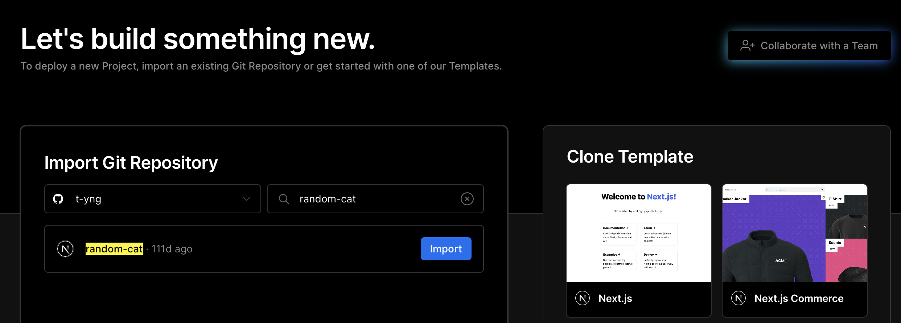
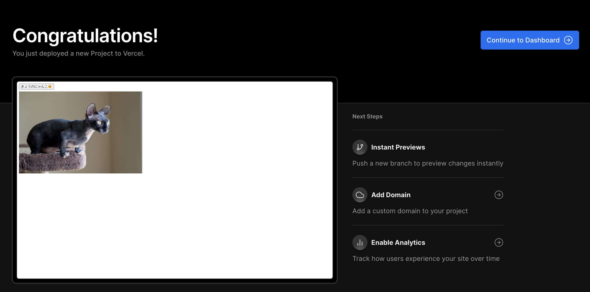

# 🚧Vercelにデプロイしてみよう

このチュートリアルでは前のNext.jsのハンズオンで作成した猫画像ジェネレーターをVercelへデプロイする方法を学びます。

## Vercelとは？

Next.jsを開発しているVercel社が提供しているフロントエンド向けのクラウドプラットフォームで、特徴としては次の点があります。

- 特別な設定をせずにゼロコンフィグでGitHubリポジトリと連携をするだけで簡単にデプロイ環境を構築できる
- プルリク単位で自動でプレビュー環境を利用できる
- JavaScriptやCSSファイルを自動で圧縮してCDN環境で配信

特にVercelはNext.jsをホスティングする環境として開発されており、Next.jsのAPIルートの自動スケールや特別な対応がなくISRを利用できるので、他のクラウドプラットフォームを利用する理由がない場合はNext.jsのホスティング環境としてVercelを利用することをオススメします。

## このチュートリアルに必要なもの

今回のチュートリアルではGitHubリポジトリとの連携を利用してデプロイ環境を構築するために、次のものが必要です。

- GitHubアカウント
- ハンズオンで作成した猫画像ジェネレータのGitHubリポジトリ

## デプロイの流れ

- アカウント作成
- Vercelにログイン
- デプロイ環境を構築するGitHubリポジトリを連携

## アカウント作成

すでにアカウントをお持ちの方はこの手順はスキップして次のログインへお進みください。

最初に[Vercel](https://vercel.com/signup)にアクセスをして、GitHubアカウントでVercelのアカウントを作成しましょう。
アカウント作成後に連携するGitHubリポジトリの選択画面が表示されるので、「GitHubリポジトリを連携」にお進みください。

## Vercelへログイン

[Vercelのログイン画面](https://vercel.com/login)に遷移してGitHubアカウントでログインをします。

## GitHubリポジトリを連携

[VercelのGitHubリポジトリ連携のページ](https://vercel.com/new)へアクセスして猫画像ジェネレーターのGitHubリポジトリを検索して「Import」ボタンをクリックします。

プロジェクトの設定画面が表示されるので、設定はデフォルトのままで「Deploy」ボタンをクリックしてください。

デプロイ完了画面が表示されればデプロイは完了です。🎉
画面のプレビュー表示がリンクになっており、クリックすることでデプロイされたアプリを表示することができます。

「Continue To Dashboard」のボタンをクリックすることでプロジェクトのダッシュボードページへ遷移できます。

## 変更を自動デプロイする

プルリクエストを作成・マージして自動デプロイを実行してみます。VercelではGitHub連携が完了した段階で自動デプロイのCI/CD環境も自動で構築されるので、プルリクエストを作成・マージするだけで自動でデプロイしたアプリを更新でき状態になっています。

実際に猫画像ジェネレーターのコードの一部を修正して自動デプロイを実行してみましょう。

::ボタンを変更する？
::プルリクを作成
::プレビュー環境を確認
::マージする
::自動デプロイを確認

## プロジェクトのダッシュボードの確認

スクリンショットで
:::caution 執筆中

- 前のハンズオンで作成した猫画像ジェネレーターをVercelでデプロイするチュートリアルを書く。

:::
