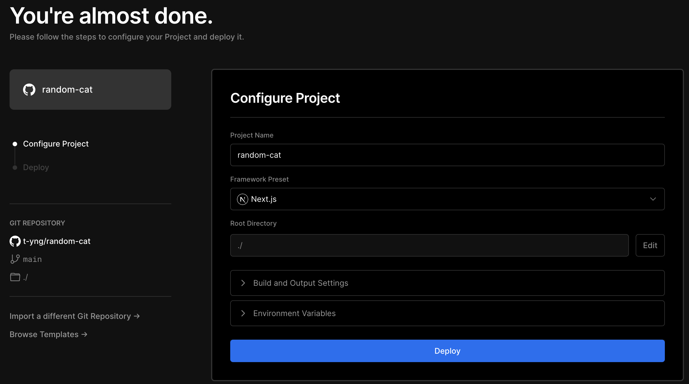
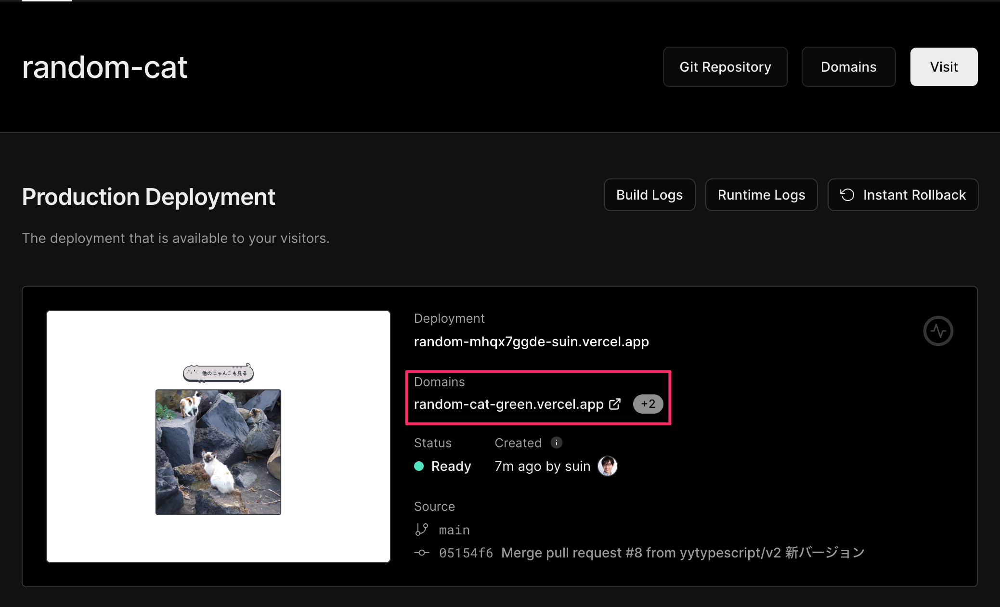
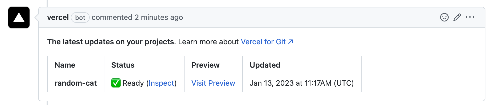
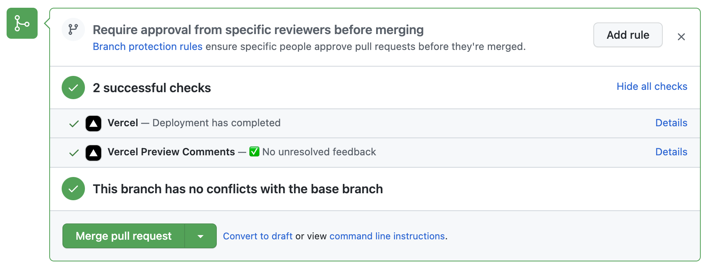
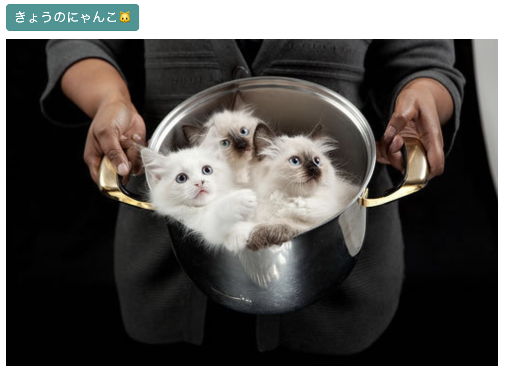
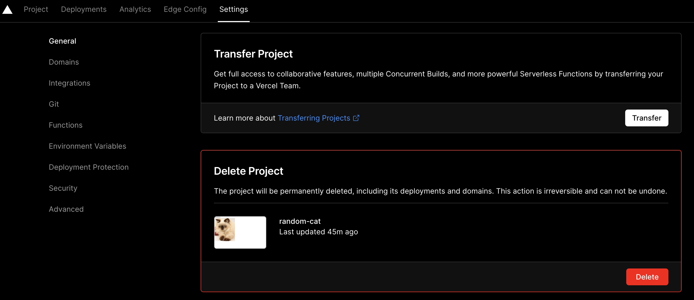
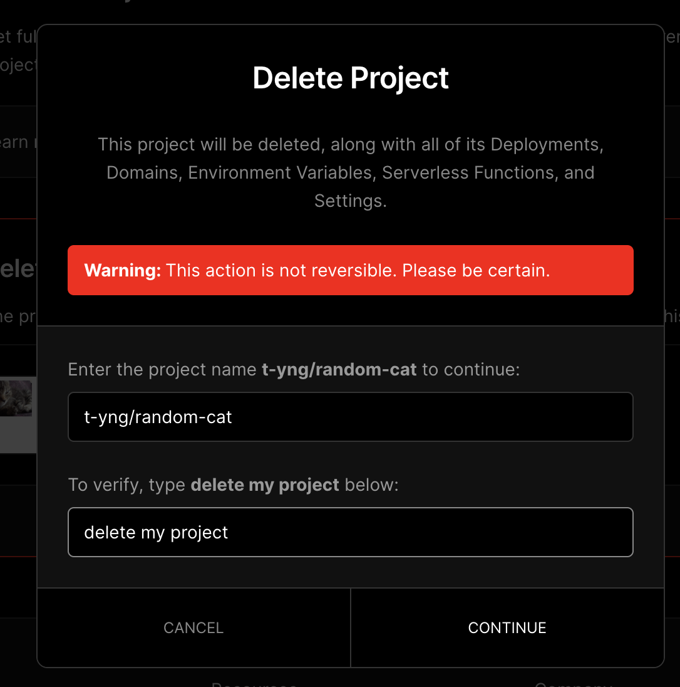

# Vercelにデプロイしてみよう

このチュートリアルでは前のNext.jsのハンズオンで作成した猫画像ジェネレーターをVercelへデプロイする方法を学びます。

## Vercelとは？

Next.jsを開発しているVercel社が提供しているフロントエンド向けのクラウドプラットフォームで、特徴としては次の点があります。

- 特別な設定をせずにゼロコンフィグでGitHubリポジトリと連携をするだけで簡単にデプロイ環境を構築できる
- プルリク単位で自動でプレビュー環境を利用できる
- JavaScriptやCSSファイルを自動で圧縮してCDN環境で配信

特にVercelはNext.jsをホスティングする環境として開発されており、Next.jsのAPIルートの自動スケールや特別な対応がなくISRを利用できるので、他のクラウドプラットフォームを利用する理由がない場合はNext.jsのホスティング環境としてVercelを利用することをオススメします。

## このチュートリアルに必要なもの

今回のチュートリアルではGitHubリポジトリとの連携を利用してデプロイ環境を構築するために、次のものが必要です。

- GitHubアカウント
- ハンズオンで作成した猫画像ジェネレータのGitHubリポジトリ

## デプロイの流れ

- アカウント作成
- Vercelにログイン
- デプロイ環境を構築するGitHubリポジトリを連携

## アカウント作成

すでにアカウントをお持ちの方はこの手順はスキップして次のログインへお進みください。

最初に[Vercel](https://vercel.com/signup)にアクセスをして、GitHubアカウントでVercelのアカウントを作成しましょう。
アカウント作成後に連携するGitHubリポジトリの選択画面が表示されるので、「GitHubリポジトリを連携」にお進みください。

## Vercelへログイン

[Vercelのログイン画面](https://vercel.com/login)に遷移してGitHubアカウントでログインをします。

## GitHubリポジトリを連携

[VercelのGitHubリポジトリ連携のページ](https://vercel.com/new)へアクセスして猫画像ジェネレーターのGitHubリポジトリを検索して「Import」ボタンをクリックします。


プロジェクトの設定画面が表示されるので、設定はデフォルトのままで「Deploy」ボタンをクリックしてください。


デプロイ完了画面が表示されればデプロイは完了です。🎉
画面のプレビュー表示がリンクになっており、クリックすることでデプロイされたアプリを表示することができます。


`Continue To Dashboard`のボタンをクリックすることでプロジェクトのダッシュボードページへ遷移できます。
ダッシュボード上でVercelが自動生成したドメインを確認できます。このドメインはプロジェクトが存続している限り変更されないため、このURLを他の人に共有することでアプリを公開することができます。



## 自動デプロイを体験

プルリクエストを作成・マージして自動デプロイを実行してみます。VercelではGitHub連携が完了した段階で自動デプロイのCI/CD環境も自動で構築されるので、プルリクエストを作成・マージするだけで自動でデプロイがされる状態になっています。

実際に猫画像ジェネレーターのコードの一部を修正して自動デプロイを実行してみましょう。

次のようにボタンのデザインを変更してGitHubリポジトリでプルリクエストを作成してください。

<!-- twoslashで記述するとコンパイルエラーが発生するのでtwoslashの指定はスキップしています -->

```tsx {10-21} title="src/pages/index.tsx"
const IndexPage: NextPage<IndexPageProps> = ({ initialCatImageUrl }) => {
  const [catImageUrl, setCatImageUrl] = useState(initialCatImageUrl);

  const handleClick = async () => {
    const image = await fetchCatImage();
    setCatImageUrl(image.url);
  };

  return (
    <div>
      <button
        onClick={handleClick}
        style={{
          backgroundColor: "#319795",
          border: "none",
          borderRadius: "4px",
          color: "white",
          padding: "4px 8px",
        }}
      >
        きょうのにゃんこ🐱
      </button>
      <div style={{ marginTop: 8, maxWidth: 500 }}>
        
      </div>
    </div>
  );
};
```

Vercelは連携しているGitHubリポジトリに新たにブランチがプッシュされると自動でビルドが実行されて、プレビュー環境をデプロイしてくれます。

プルリクエストを作成するとVercel BOTが画像のようにビルドのステータスとプレビュー環境のURLをコメントとしてくれるので、`Visit Preview`のリンクをクリックすることでレビュアーは簡単に新しい変更の確認をすることができます。



ビルドの結果はプルリクエストのstatus checksにも表示されるので、ビルドが失敗している状態で誤ってデプロイをする事故も防ぐこともできます。



`Merge pull request`ボタンをクリックして、このプルリクエストをマージしてみましょう。ベースブランチに新しくブランチがマージされると本番環境に更新が自動でデプロイされます。

先ほど確認した本番環境のURLにアクセスをすることで、ボタンのデザインが変更されており今回の修正が本番環境に自動でデプロイされたのを確認できます。😺



## プロジェクトを削除

プロジェクトが残って気になる方は、Settingsページに移動して`Delete`ボタンをクリックし、ダイアログで必要なテキストを入力することでプロジェクトを削除できます。



