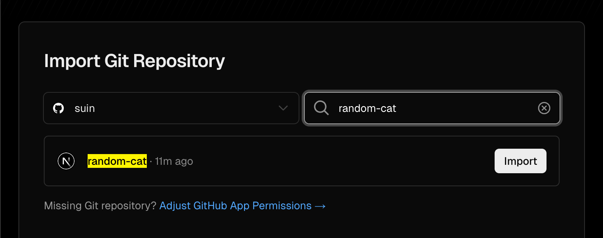
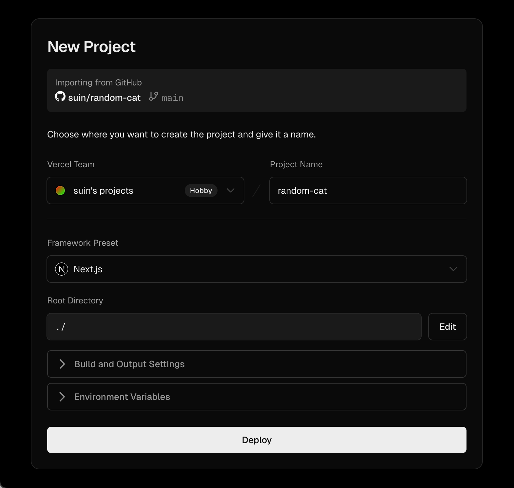
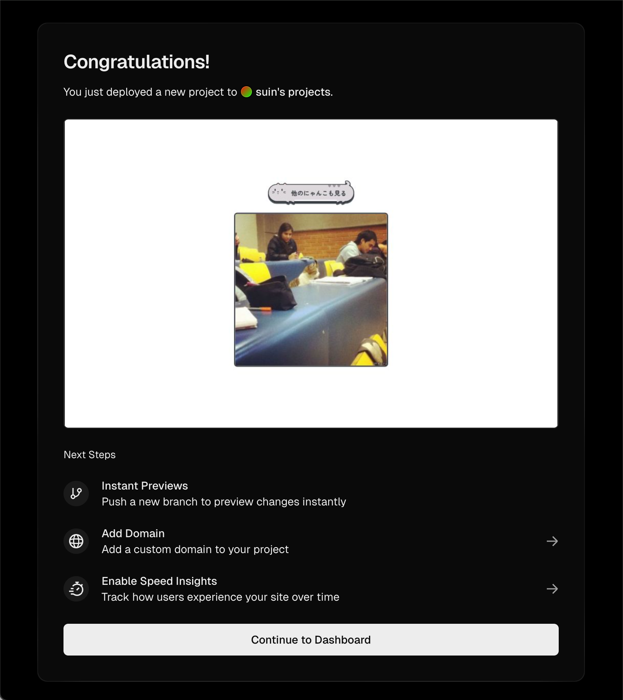
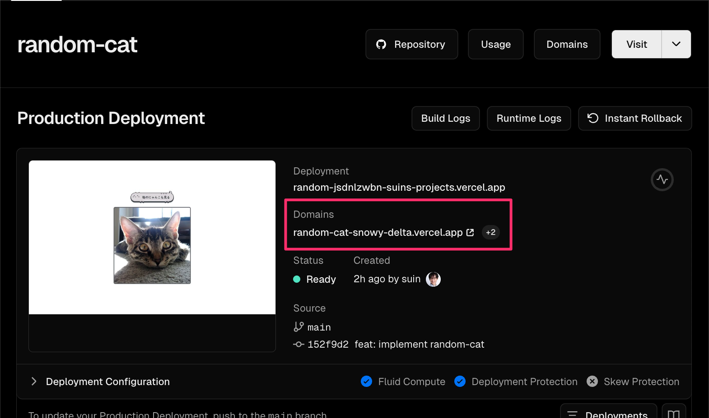
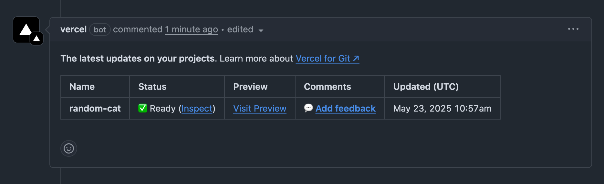
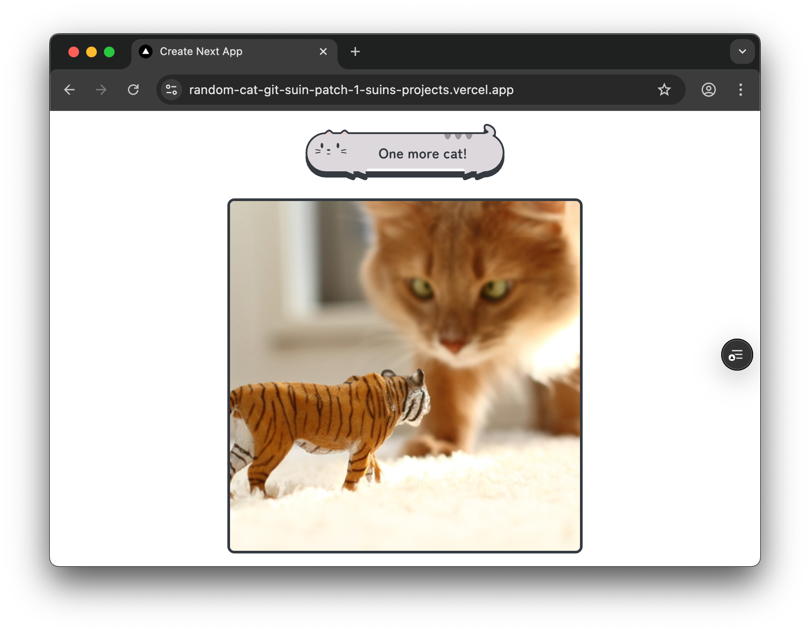
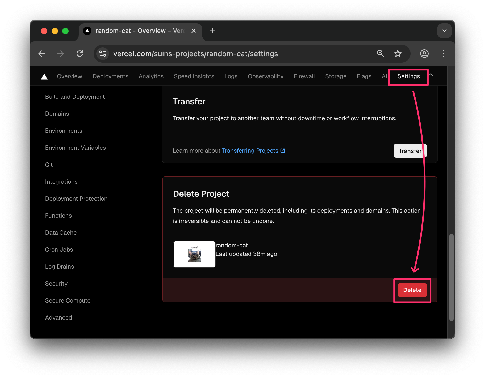
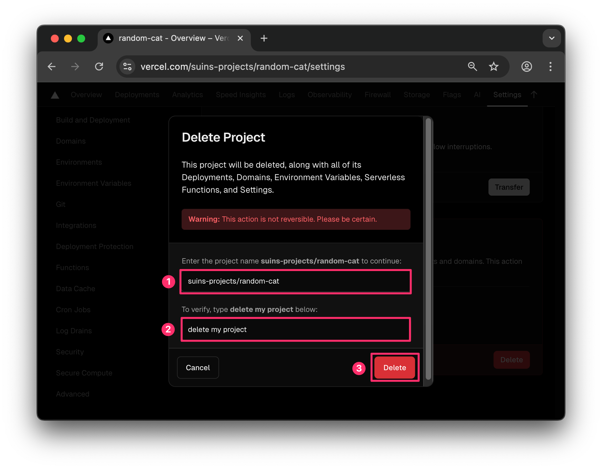

# Deploy lên Vercel

Trong tutorial này, bạn sẽ học cách deploy lên Vercel ứng dụng tạo ảnh mèo đã tạo trong hands-on Next.js trước đó.

## Vercel là gì?

Là cloud platform cho frontend do Vercel - công ty phát triển Next.js - cung cấp, có các đặc điểm sau.

- Có thể xây dựng môi trường deploy dễ dàng chỉ bằng cách liên kết với GitHub repository mà không cần config đặc biệt (zero config)
- Có thể sử dụng môi trường preview tự động theo từng pull request
- Tự động nén file JavaScript và CSS và phân phối qua môi trường CDN

Đặc biệt Vercel được phát triển như môi trường hosting Next.js, có thể sử dụng tính năng server-side của Next.js mà không cần setup đặc biệt, nên nếu không có lý do sử dụng cloud platform khác, Vercel là lựa chọn được khuyến nghị làm môi trường hosting cho Next.js.

## Những thứ cần thiết cho tutorial này

Trong tutorial lần này, để xây dựng môi trường deploy bằng cách liên kết với GitHub repository, cần những thứ sau.

- Tài khoản GitHub
- Code đã tạo trong "[Tạo trình tạo ảnh mèo với Next.js](./nextjs.md)" và GitHub repository đã push code đó
  - Nếu bạn đã thực hiện tutorial trên, hãy push code vào repository của tài khoản GitHub của bạn.
  - Nếu bạn không cần phải là code tự tạo, cũng có thể [fork](https://docs.github.com/ja/get-started/quickstart/fork-a-repo) [random-cat repository](https://github.com/yytypescript/random-cat) do sách này cung cấp.

## Quy trình deploy

- Tạo tài khoản Vercel
- Đăng nhập vào Vercel
- Liên kết GitHub repository

## Tạo tài khoản Vercel

:::note
Nếu bạn đã có tài khoản Vercel, hãy bỏ qua bước này.
:::

Đầu tiên, truy cập [Vercel](https://vercel.com/signup) và tạo tài khoản Vercel bằng tài khoản GitHub. Sau khi tạo tài khoản, màn hình chọn GitHub repository để liên kết sẽ hiển thị, hãy tiếp tục với "Liên kết GitHub repository".

## Đăng nhập vào Vercel

Chuyển đến [màn hình đăng nhập Vercel](https://vercel.com/login) và đăng nhập bằng tài khoản GitHub.

## Liên kết GitHub repository

Truy cập [trang liên kết GitHub repository của Vercel](https://vercel.com/new), tìm kiếm GitHub repository của trình tạo ảnh mèo và click nút "Import".



Màn hình config project hiển thị, để config mặc định và click nút "Deploy".



Nếu màn hình hoàn tất deploy hiển thị thì deploy đã hoàn thành. 🎉Preview hiển thị trên màn hình là link, click vào có thể hiển thị app đã deploy.



Click nút "Continue To Dashboard" để chuyển đến trang dashboard của project. Trên dashboard có thể xác nhận domain được Vercel tự động tạo. Domain này không thay đổi miễn là project còn tồn tại, nên có thể công khai app bằng cách chia sẻ URL này với người khác.



## Trải nghiệm auto deploy

Hãy tạo và merge pull request để thực thi auto deploy. Trong Vercel, môi trường CI/CD cho auto deploy cũng được tự động xây dựng khi hoàn tất liên kết GitHub, nên chỉ cần tạo và merge pull request là tự động deploy.

Hãy thực sự sửa một phần code của trình tạo ảnh mèo và thực thi auto deploy.

Thay đổi text của button từ "Xem mèo khác" thành "One more cat!" như sau và tạo pull request trên GitHub repository.

```tsx twoslash {22-24} title="app/cat-image.tsx"
// @filename: index.tsx
// @jsx: react-jsx
// ---cut---
"use client";
import { useState } from "react";
import { fetchImage } from "./fetch-image";
import styles from "./page.module.css";
type CatImageProps = {
  url: string;
};
export function CatImage({ url }: CatImageProps) {
  const [imageUrl, setImageUrl] = useState<string>(url);
  const refreshImage = async () => {
    setImageUrl("");
    const image = await fetchImage();
    setImageUrl(image.url);
  };
  return (
    <div className={styles.page}>
      <button onClick={refreshImage} className={styles.button}>
        One more cat!
      </button>
      <div className={styles.frame}>
        {imageUrl && }
      </div>
    </div>
  );
}
// ---cut-after---
// @filename: fetch-image.ts
type Image = {
  url: string;
};
export declare function fetchImage(): Promise<Image>;
export {};
```

Vercel tự động thực thi build và deploy môi trường preview khi có branch mới được push vào GitHub repository đã liên kết.

Khi tạo pull request, Vercel BOT sẽ comment status của build và URL môi trường preview như hình, reviewer có thể dễ dàng xác nhận thay đổi mới bằng cách click link "Visit Preview".



Kết quả build cũng hiển thị trong status checks của pull request, nên cũng có thể ngăn ngừa sự cố deploy nhầm khi build fail.


Click nút "Merge pull request" để merge pull request này. Khi có branch mới được merge vào base branch, update sẽ tự động deploy vào môi trường production.

Bằng cách truy cập URL môi trường production đã xác nhận trước đó, có thể xác nhận design của button đã thay đổi và sửa đổi lần này đã được tự động deploy vào môi trường production. 😺



## Xóa project

Nếu bạn lo lắng về project còn lại, có thể xóa project bằng cách di chuyển đến trang Settings, click nút "Delete" và nhập text cần thiết trong dialog.



