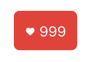
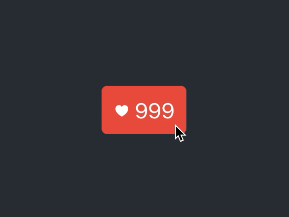

# Reactでいいねボタンを作ろう

このチュートリアルでは、TypeScriptとReactの両方を用いて、SNSでよく見かける「いいねボタン」のUIを実装していきます。

本チュートリアルは、TypeScriptとReactによるコーディングの体験をすることを主眼に置いています。そのため、TSとReactの理論的な説明はしません。「TypeScriptとReactでUIを開発するにはどのような流れになるのか」を感じ取って頂くことを目的としています。

また、Reactの専門書と比べて、本書の解説は詳しさや正確さは劣ります。それでも、初めてReactに触れる方でも読み進められるよう、Reactについて随時ワンポイント解説していくので、安心してお読みください。

## Reactとは？

ReactはFacebook社が開発した、ウェブアプリケーションのUIを作るためのパッケージです。JavaScriptやTypeScriptだけでもインタラクティブなUIは実装できます。しかし、UIが複雑になるとパッケージなしではコードの記述量が増大したり、可読性が悪くなったりと難しさが増します。なんといっても、UIが今どのような状態なのかを管理するのは、Reactなしではプログラマが把握しきれない複雑さになることがあります。Reactを使うと、複雑なUIやインタラクションを短く簡潔に読みやすく書けるようになり、状態の管理も分かりやすくなります。

## Reactの3大特徴

Reactはどのような特徴を持ったパッケージなのでしょうか？ここではReactの特徴をおおまかに3つに分けて見ていきます。Reactについて多少の予備知識を得たい方は、このセクションをお読みください。今すぐコードを書きたいという方は、ここは読み飛ばしても問題ありません。

### 特徴その1: 仮想DOM

Reactは仮想DOMという考えを採用しています。仮想DOMを理解するには、仮想ではない普通のDOMとは何かを知る必要があります。DOM\(document object model\)とは、HTMLの構造をJavaScriptで参照したり操作したりする仕組みです。これがあるおかげで、HTMLを単なる文字列ではなく、オブジェクトとして処理することができます。HTMLを操作するためのAPIのようなものです。

プログラマがDOMを操作すると、間接的にHTMLが書き換えられ、その結果が画面に描画されます。動的なUIはこのような仕掛けで成り立っているのです。

```javascript
// <input id="email">の文字色を赤色にするDOM操作の例
const emailInput = document.getElementById("email");
emailInput.style.color = "red";
```

DOMは必ずしもプログラマにとって使いやすいAPIではありません。上の例のようなスタイルを少し変更するくらいなら実用的ですが、複雑なUIを作ろうとすると途端に難しくなります。注意深く実装しないと、表示や状態の変更し忘れといったバグを生みやすかったり、操作の仕方が悪くパフォーマンス面で問題が出たりします。

仮想DOMはリアルDOMのプロキシのようなもので、リアルDOMと比べて、状態管理上のバグを起こしにくい設計になっていたり、パフォーマンス面では描画処理を最適化してくれたりします。プログラマにとっては、リアルDOMを扱うときのような慎重さが不要になります。画面表示を変えたければ、仮想DOMを操作します。仮想DOMに起こった変更はリアルDOMに伝わり、画面描画に現れてきます。仮想DOMは、複雑なUIをリアルDOMほど苦労せずに実装するための仕組みなのです。

### 特徴その2: 宣言的UI

Reactの2つ目の特徴はUIを宣言的に書けるという点です。Reactを使わずにUIを実装すると、命令的なコードになります。命令的なコードでは、何かを表示したい場合でもどのように表示するかのhowの部分を細かく書く必要があります。

次のHTMLような簡単なリストを例に、命令的なコードと宣言的なコードとでどのように違ってくるか見ていきましょう。

```markup
<ul>
  <li>リンゴ</li>
  <li>オレンジ</li>
  <li>ぶどう</li>
</ul>
```

まず、命令的なコードでは、次のようになります。

```javascript
const list = document.createElement("ul");
const apple = document.createElement("li");
apple.innerText = "リンゴ";
list.append(apple);
const orange = document.createElement("li");
orange.innerText = "オレンジ";
list.append(orange);
const grape = document.createElement("li");
grape.innerText = "ぶどう";
list.append(grape);
```

この処理を日本語に書き下すと、

* `ul`要素を作り、変数`list`に代入する
* `li`要素を作り、変数`apple`に代入する
* `apple`のテキストは「リンゴ」にする
* `list`に`apple`を追加する
* `li`要素を作り、変数`orange`に代入する
* `orange`のテキストは「オレンジ」にする
* `list`に`orange`を追加する
* ...

といった具合に、3つの果物のリストのようないたって簡単なUIを作るにも、どのように作ったらいいかを細かく記述しなければなりません。これを見るだけでも、UIを命令的に書くのは作るのも大変ですし、これを保守していくことを考えるとあまりいい書き方には思えないのではないでしょうか。

今度は宣言的な書き方を見てみましょう。次はReactでの書き方です。

```javascript
function Fruits() {
  return (
    <ul>
      <li>リンゴ</li>
      <li>オレンジ</li>
      <li>ぶどう</li>
    </ul>
  );
}
```

見てのとおり、どのように表示するかの部分はなく、「このような表示になってほしい」という目標だけが書かれています。

宣言的UIではこのように、実装の細部やアルゴリズムを気にしなくて良くなるため「どんなUIにしたいか」の一点に集中してコードを書いていけるようになります。

### 特徴その3: コンポーネントベース

Reactの3つ目の特徴は、コンポーネントベースであることです。コンポーネントというのはUIの部品だと考えてください。たとえば、小さいもので言えばボタンや入力欄、より大きめの部品だとフォーム、さらに大きい部品だとページなどがコンポーネントにあたります。

Reactでは、小さいコンポーネントを組み合わせて、大きなアプリケーションを成すという思想のもとで開発していけるので、コンポーネントベースのUIライブラリという位置づけになっています。

コンポーネントベースのメリットは、同じコンポーネントを再利用できるという点です。たとえば、ボタンコンポーネントを1つ作っておけば、それをアプリケーションの至るところで使い回せます。プログラマは同じようなコードを何度も書かなくて済むので、開発効率が良くなるわけです。

加えて、オープンソースのコンポーネントも数多く公開されているので、プログラマは自分でいちからコンポーネントを作らなくても、公開されているコンポーネントをダウンロードして使うこともできます。カレンダーUIのような自力で作ると面倒なコンポーネントも種類豊富に公開されているので、開発者はオープンソースのコンポーネントを使うとより手軽にアプリケーションを作ることができます。

## このチュートリアルに必要なもの

このチュートリアルをやってみるに当たって、いくつか必要なツールがあります。それらはここにリストアップしておくのであらかじめ用意しておいてください。

* node
* npm
* VS CodeやWebStormなどのエディター

## プロジェクトを作る

まず、`npx create-react-app`コマンドでReactプロジェクトのひながたを生成します。

```bash
npx create-react-app like-button --template typescript
```

1分ほどするとひながたの生成が完了します。like-buttonディレクトリが生成されるので、そのディレクトリに移動すると、ひながたが生成されているのが分かります。

```bash
cd ./like-button
ls -la
drwxr-xr-x    - suin 23 Oct 20:28 .git
.rw-r--r--  310 suin 23 Oct 20:21 .gitignore
drwxr-xr-x    - suin 23 Oct 20:27 node_modules
.rw-r--r--  899 suin 23 Oct 20:21 package.json
drwxr-xr-x    - suin 23 Oct 20:21 public
.rw-r--r-- 2.1k suin 23 Oct 20:21 README.md
drwxr-xr-x    - suin 23 Oct 20:21 src
.rw-r--r--  491 suin 23 Oct 20:21 tsconfig.json
.rw-r--r-- 473k suin 23 Oct 20:21 yarn.lock
```

このディレクトリにて`npm run start`を実行すると、Reactのローカル開発サーバーが起動します。

```bash
npm run start
```

開発サーバーが起動すると自動的にブラウザが開かれ、ひながたアプリの様子が確認できます。ブラウザが起動しない場合は、コンソールに表示されているURLをブラウザで開いてください。


ここからは実際にコードを書いて行きますので、生成したlike-buttonプロジェクトをお好みのエディターで開いてください。

ひながた初期状態の上のページはsrc/App.tsxの内容が描画されています。ためしに、src/App.tsxを変更してみましょう。App.tsxの`<header>`要素の中身を消して、そこにお好きな文言に書き加えてみてください。ここでは「TypeScriptはいいぞ」に書き換えてみます。


```typescript
import React from 'react';
import logo from './logo.svg';
import './App.css';

function App() {
  return (
    <div className="App">
      <header className="App-header">
        TypeScriptはいいぞ
      </header>
    </div>
  );
}

export default App;
```



**ワンポイント解説: .tsxって何？TypeScriptの中にHTMLが書ける？**

App.tsxを見てこのような疑問を持ったのでは無いでしょうか。このHTMLに見える部分はJSXと言われるものです。JSXはJavaScriptを拡張した言語で、JavaScriptの中にXMLを直接書けるようにしたものです。XMLとHTMLは厳密には異なりますが、ここでは同じものと考えてください。

UIを実装しようとするとHTMLと密接に関わるコードを書くことになりますが、JavaScriptの構文だけでHTMLを表現しようとすると、可読性が低くなりがちです。ReactではJSXを採用することで可読性の問題を解決しました。JSXは、HTMLをほぼありのままに書けるので、可読性の高いコードになります。

TypeScriptとJSXは元々無関係の言語ですが、開発者の利便性のために、TypeScriptでもJSXが書けるようになっています。

JSXを書いたJavaScriptファイルは拡張子を.jsxにします。同様にTypeScriptファイルは.tsxにします。


書き換えたらファイルを保存し、ブラウザで確認してみてください。ブラウザに書いた文言が表示されていればOKです。


## ボタンを作る場所を用意する

ここからは、いいねボタンを実際に作っていきます。まずは、いいねボタンを実装する場所を作ります。

まず、先ほど「TypeScriptはいいぞ」と書いたところを`<LikeButton />`に変えます。次に、`LikeButton`関数を作ります。次のコードのようになるようにしてください。


```typescript
import React from 'react';
import './App.css';

function App() {
  return (
    <div className="App">
      <header className="App-header">
        <LikeButton />
      </header>
    </div>
  );
}

function LikeButton() {
  return <span>いいねボタン予定地</span>;
}

export default App;
```


この`LikeButton`関数が、これからいいねボタンを作っていく場所になります。


**ワンポイント解説: 関数コンポーネント**

ReactのJSXでは、HTMLタグの`div`や`header`が使えるだけでなく、自分で定義した関数もタグとして使うことができます。上で定義した`LikeButton`関数はその一例です。JSXを戻り値として返す関数だけがタグとして使えます。上の例では、`span`タグが戻り値になっているのがわかると思います。

JSXを戻り値にする関数をReact用語で「関数コンポーネント」と言います。Reactを使ったフロントエンドアプリケーション開発では、関数コンポーネントをうまく使うことがポイントになります。画面の部品をコンポーネントにしておくと、再利用できたり変更が一箇所で済んだりと、開発や保守がしやすくなります。


## ボタンのビジュアルを作り込む

いいねボタンの実装場所が確保できたので、ここではボタンのタグを変更したり、CSSを書いたりして、ボタンの見た目を作っていきます。今回作るボタンは次の図のようなシンプルなものです。



まずは、`LikeButton`関数の`span`タグのテキストを`♥ {count}`にします。この`count`は変数なので、その変数も一緒に定義します。


```typescript
function LikeButton() {
  const count = 999;
  return <span>♥ {count}</span>;
}
```


`count`変数は固定値になっていますが、あとでクリックしたときに増減するように変えるので今はこれで構いません。JSX内では`{}`で囲まれた部分には、JavaScriptの変数や式が書けます。上の例は変数名だけですが、`{count + 1}`のような式も有効です。

次に、CSSのクラスを割り当てるために、`span`タグに`className`属性を追加します。


```typescript
function LikeButton() {
  const count = 999;
  return <span className="likeButton">♥ {count}</span>;
}
```



**ワンポイント解説: class属性は使わない？**

HTMLではCSSクラスを指定するのに`class`属性を用いるので、ここで`className`属性にしていることに驚いたのではないでしょうか。これは初期のReactがDOMプロパティに直接値をセットしていた名残りです。DOMでは、HTMLの`class`属性が`className`プロパティになります。現在は、ReactがDOMプロパティを直接セットすることが無くなったので、`className`属性に縛られる技術的理由はないのですが、React開発陣は`class`属性への乗り換えは慎重のようです。これまで作られたコンポーネントが動かなくなるかも知れないからです。また、両方サポートする気もないようです。`class`と`className`のどちらもOKとなると混乱を招くからです。


続いて、`likeButton`クラスのCSSを書いていきます。Reactではスタイルシートを実装するのにいくつか方法がありますが、ここではApp.cssにCSSを書く方法にします。次のCSSをApp.cssの最後に追加してください。


```css
.likeButton {
  background-color: rgb(231, 76, 60);
  color: white;
  padding: 0.8rem;
  border-radius: 0.4rem;
  cursor: pointer;
}
```


App.cssに上の内容を書いたら、ブラウザで確認してみましょう。スタイルが効いていれば、次の図のような表示になっているはずです。



**トラブルシューティング**

App.cssはApp.tsxで`import`しているので特に何もしなくても`LikeButton`コンポーネントのスタイルに反映されます。もし、スタイルが反映されていないようなら、App.tsxにApp.cssを`import`するコードがあるか確認してください。


```typescript
import React from 'react';
import './App.css'; // この行があるか確認する

function App() {
    // ...
```



ここまでで、ボタンのビジュアルの作り込みは一旦完了です。

## ボタンに機能をつける

このままでは、ボタンを押しても何も起きません。ここからは、ボタンを押したときに999がひとつ増えて1,000にカウントアップされる機能を作っていきます。

現状のボタンは`count`変数を表示していますが、この変数は固定値になっています。この値が変動できるように、Reactの`useState`関数を使い、カウント数の状態をReactに管理させるようにします。


```typescript
import React, {useState} from "react";
           // ^^^^^^^^^^ ここも追加

/* ... */

function LikeButton() {
  const [count, setCount] = useState(999); // このように書き換える
  return <span className="likeButton">♥ {count}</span>;
}
```


この`useState`は関数コンポーネントに状態を持たせるためのReactの機能です。`useState`の戻り値を`count`と`setCount`の2つの変数に代入しています。`count`には`999`のような値が代入され、`setCount`には`count`の値を変更する関数が代入されます。

次に、`span`要素をクリックしたときに、`count`の値を増加する`handleClick`関数を実装します。この関数では、現在の`count`の値に1を足した値を`setCount`関数に渡すようにします。そして、`span`要素の`onClick`属性に`handleClick`関数を渡します。

```typescript
function LikeButton() {
  const [count, setCount] = useState(999);
  const handleClick = () => {
    setCount(count + 1);
  };
  return <span className="likeButton" onClick={handleClick}>♥ {count}</span>;
}
```

これで、ボタンをクリックしたらいいねの数が増えるようになります。



以上でTypeScript作るReactいいねボタンは完成です。

